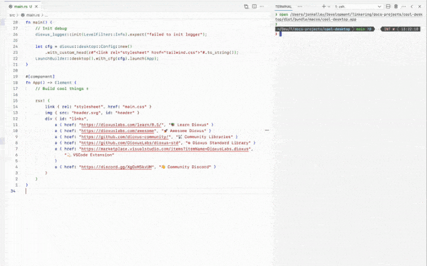

<p>
    <p align="center" >
      <!-- 
       -->
      <!-- <a href="https://dioxuslabs.com">
          
      </a> -->
      
      
      <!--  -->
      <br>
    </p>
</p>
<div align="center">
  <!-- Crates version -->
  <a href="https://crates.io/crates/dioxus">
    
  </a>
  <!-- Downloads -->
  <a href="https://crates.io/crates/dioxus">
    
  </a>
  <!-- docs -->
  <a href="https://docs.rs/dioxus">
    
  </a>
  <!-- CI -->
  <a href="https://github.com/jkelleyrtp/dioxus/actions">
    
  </a>

  <!--Awesome -->
  <a href="https://dioxuslabs.com/awesome">
    
  </a>
  <!-- Discord -->
  <a href="https://discord.gg/XgGxMSkvUM">
    
  </a>
</div>

<div align="center">
  <h3>
    <a href="https://dioxuslabs.com"> Website </a>
    <span> | </span>
    <a href="https://github.com/DioxusLabs/dioxus/tree/main/examples"> Examples </a>
    <span> | </span>
    <a href="https://dioxuslabs.com/learn/0.7/tutorial"> Tutorial </a>
    <span> | </span>
    <a href="https://github.com/DioxusLabs/dioxus/blob/main/notes/translations/zh-cn/README.md"> 中文 </a>
    <span> | </span>
    <a href="https://github.com/DioxusLabs/dioxus/blob/main/notes/translations/pt-br/README.md"> PT-BR </a>
    <span> | </span>
    <a href="https://github.com/DioxusLabs/dioxus/blob/main/notes/translations/ja-jp/README.md"> 日本語 </a>
    <span> | </span>
    <a href="https://github.com/DioxusLabs/dioxus/blob/main/notes/translations/tr-tr"> Türkçe </a>
    <span> | </span>
    <a href="https://github.com/DioxusLabs/dioxus/blob/main/notes/translations/ko-kr"> 한국어 </a>
  </h3>
</div>
<br>
<!-- <p align="center">
  <a href="https://github.com/DioxusLabs/dioxus/releases/tag/v0.7.0">✨ Dioxus 0.7 is out!!! ✨</a>
</p> -->
<br>

Build for web, desktop, and mobile, and more with a single codebase. Zero-config setup, integrated hot-reloading, and signals-based state management. Add backend functionality with Server Functions and bundle with our CLI.

```rust
fn app() -> Element {
    let mut count = use_signal(|| 0);

    rsx! {
        h1 { "High-Five counter: {count}" }
        button { onclick: move |_| count += 1, "Up high!" }
        button { onclick: move |_| count -= 1, "Down low!" }
    }
}
```

## ⭐️ Unique features:

- Cross-platform apps in three lines of code (web, desktop, mobile, server, and more)
- [Ergonomic state management](https://dioxuslabs.com/blog/release-050) combines the best of React, Solid, and Svelte
- Built-in featureful, type-safe, fullstack web framework
- Integrated bundler for deploying to the web, macOS, Linux, and Windows
- Subsecond Rust hot-patching and asset hot-reloading
- And more! [Take a tour of Dioxus](https://dioxuslabs.com/learn/0.7/).

## Instant hot-reloading

With one command, `dx serve` and your app is running. Edit your markup, styles, and see changes in milliseconds. Use our experimental `dx serve --hotpatch` to update Rust code in real time.

<div align="center">
  
  <!-- <video src="https://private-user-images.githubusercontent.com/10237910/386919031-6da371d5-3340-46da-84ff-628216851ba6.mov" width="500"></video> -->
  <!-- <video src="https://private-user-images.githubusercontent.com/10237910/386919031-6da371d5-3340-46da-84ff-628216851ba6.mov" width="500"></video> -->
</div>

## Build Beautiful Apps

Dioxus apps are styled with HTML and CSS. Use the built-in TailwindCSS support or load your favorite CSS library. Easily call into native code (objective-c, JNI, Web-Sys) for a perfect native touch.

<div align="center">
  
</div>


## Truly fullstack applications

Dioxus deeply integrates with [axum](https://github.com/tokio-rs/axum) to provide powerful fullstack capabilities for both clients and servers. Pick from a wide array of built-in batteries like WebSockets, SSE, Streaming, File Upload/Download, Server-Side-Rendering, Forms, Middleware, and Hot-Reload, or go fully custom and integrate your existing axum backend.

<div align="center">
  
</div>

## Experimental Native Renderer

Render using web-sys, webview, server-side-rendering, liveview, or even with our experimental WGPU-based renderer. Embed Dioxus in Bevy, WGPU, or even run on embedded Linux!

<div align="center">
  
</div>


## First-party primitive components

Get started quickly with a complete set of primitives modeled after shadcn/ui and Radix-Primitives.

<div align="center">
  
</div>

## First-class Android and iOS support

Dioxus is the fastest way to build native mobile apps with Rust. Simply run `dx serve --platform android` and your app is running in an emulator or on device in seconds. Call directly into JNI and Native APIs.

<div align="center">
  
</div>


## Bundle for web, desktop, and mobile

Simply run `dx bundle` and your app will be built and bundled with maximization optimizations. On the web, take advantage of [`.avif` generation, `.wasm` compression, minification](https://dioxuslabs.com/learn/0.7/tutorial/assets), and more. Build WebApps weighing [less than 50kb](https://github.com/ealmloff/tiny-dioxus/) and desktop/mobile apps less than 5mb.

<div align="center">
  
</div>


## Fantastic documentation

We've put a ton of effort into building clean, readable, and comprehensive documentation. All html elements and listeners are documented with MDN docs, and our Docs runs continuous integration with Dioxus itself to ensure that the docs are always up to date. Check out the [Dioxus website](https://dioxuslabs.com/learn/0.7/) for guides, references, recipes, and more. Fun fact: we use the Dioxus website as a testbed for new Dioxus features - [check it out!](https://github.com/dioxusLabs/docsite)

<div align="center">
  
</div>


## Community

Dioxus is a community-driven project, with a very active [Discord](https://discord.gg/XgGxMSkvUM) and [GitHub](https://github.com/DioxusLabs/dioxus/issues) community. We're always looking for help, and we're happy to answer questions and help you get started. [Our SDK](https://github.com/DioxusLabs/dioxus-std) is community-run and we even have a [GitHub organization](https://github.com/dioxus-community/) for the best Dioxus crates that receive free upgrades and support.

<div align="center">
  
</div>

## Full-time core team

Dioxus has grown from a side project to a small team of fulltime engineers. Thanks to the generous support of FutureWei, Satellite.im, the GitHub Accelerator program, we're able to work on Dioxus full-time. Our long term goal is for Dioxus to become self-sustaining by providing paid high-quality enterprise tools. If your company is interested in adopting Dioxus and would like to work with us, please reach out!

## Supported Platforms

<div align="center">
  <table style="width:100%">
    <tr>
      <td>
      <b>Web</b>
      </td>
      <td>
        <ul>
          <li>Render directly to the DOM using WebAssembly</li>
          <li>Pre-render with SSR and rehydrate on the client</li>
          <li>Simple "hello world" at about 50kb, comparable to React</li>
          <li>Built-in dev server and hot reloading for quick iteration</li>
        </ul>
      </td>
    </tr>
    <tr>
      <td>
      <b>Desktop</b>
      </td>
      <td>
        <ul>
          <li>Render using Webview or - experimentally - with WGPU or <a href="https://freyaui.dev">Freya</a> (Skia) </li>
          <li>Zero-config setup. Simply `cargo run` or `dx serve` to build your app </li>
          <li>Full support for native system access without IPC </li>
          <li>Supports macOS, Linux, and Windows. Portable <3mb binaries </li>
        </ul>
      </td>
    </tr>
    <tr>
      <td>
      <b>Mobile</b>
      </td>
      <td>
        <ul>
          <li>Render using Webview or - experimentally - with WGPU or Skia </li>
          <li>Build .ipa and .apk files for iOS and Android </li>
          <li>Call directly into Java and Objective-C with minimal overhead</li>
          <li>From "hello world" to running on device in seconds</li>
        </ul>
      </td>
    </tr>
    <tr>
      <td>
      <b>Server-side Rendering</b>
      </td>
      <td>
        <ul>
          <li>Suspense, hydration, and server-side rendering</li>
          <li>Quickly drop in backend functionality with server functions</li>
          <li>Extractors, middleware, and routing integrations</li>
          <li>Static-site generation and incremental regeneration</li>
        </ul>
      </td>
    </tr>
  </table>
</div>

## Running the examples

> The examples in the main branch of this repository target the git version of dioxus and the CLI. If you are looking for examples that work with the latest stable release of dioxus, check out the [0.6 branch](https://github.com/DioxusLabs/dioxus/tree/v0.6/examples).

The examples in the top level of this repository can be run with:

```sh
cargo run --example <example>
```

However, we encourage you to download the dioxus-cli to test out features like hot-reloading. To install the most recent binary CLI, you can use cargo binstall.

```sh
curl -fsSL https://dioxuslabs.com/install.sh | bash
```

If this CLI is out-of-date, you can install it directly from git or cargo-binstall

```sh
cargo install --git https://github.com/DioxusLabs/dioxus dioxus-cli --locked
```

With the CLI, you can also run examples with the web platform. You will need to disable the default desktop feature and enable the web feature with this command:

```sh
dx serve --example <example> --platform web -- --no-default-features
```

## Contributing

- Check out the website [section on contributing](https://dioxuslabs.com/learn/0.7/beyond/contributing).
- Report issues on our [issue tracker](https://github.com/dioxuslabs/dioxus/issues).
- [Join](https://discord.gg/XgGxMSkvUM) the discord and ask questions!

<a href="https://github.com/dioxuslabs/dioxus/graphs/contributors">
  
</a>

## License

This project is licensed under either the [MIT license] or the [Apache-2 License].

[apache-2 license]: https://github.com/DioxusLabs/dioxus/blob/master/LICENSE-APACHE
[mit license]: https://github.com/DioxusLabs/dioxus/blob/master/LICENSE-MIT

Unless you explicitly state otherwise, any contribution intentionally submitted
for inclusion in Dioxus by you, shall be licensed as MIT or Apache-2, without any additional
terms or conditions.


## 🌐 Web Resources & Interactive Index
- [IDLE DAIRY FARM TYCOON](https://quizzesarena.onrender.com/idle-dairy-farm-tycoon.html)
- [BLOCK PIXEL GUN APOCALYPSE 3](https://mindconvert.netlify.app/block-pixel-gun-apocalypse-3.html)
- [WATER JUNK WARRIORS](https://learnaction.github.io/water-junk-warriors.html)
- [TRI PEAKS EMERLAND SOLITAIRE](https://brainquests.pages.dev/tri-peaks-emerland-solitaire.html)
- [WORD SCRAMBLE FAMILY TALES](https://eduquests.netlify.app/word-scramble-family-tales.html)
- [PLANET EVOLUTION IDLE CLICKER](https://brainquests.pages.dev/planet-evolution-idle-clicker.html)
- [COOL MAN](https://eduquests.github.io/cool-man.html)
- [INDEX5](https://quizzesarena.github.io/index5.html)
- [CATEGORY CASUAL971](https://welearnaction.onrender.com/category-casual971.html)
- [NEKOS ADVENTURE](https://eduquests.onrender.com/nekos-adventure.html)
- [CRAZY SCREW KING](https://brainquests.pages.dev/crazy-screw-king.html)
- [DESIGN WITH ME SUPERHERO TUTU OUTFITS](https://eduquestsjp.pages.dev/design-with-me-superhero-tutu-outfits.html)
- [HIPPO SUPERMARKET](https://eduquestsjp.pages.dev/hippo-supermarket.html)
- [FOOD TRUCK CHEF](https://learnaction.github.io/food-truck-chef.html)
- [CATEGORY ANIMAL](https://quizzesarena.onrender.com/category-animal.html)
- [GEOMETRY VIBES 3D](https://brainquests.pages.dev/geometry-vibes-3d.html)
- [CATEGORY MAHJONG 3](https://quizzesarena.onrender.com/category-mahjong-3.html)
- [INDEX13](https://eduquestsfr.pages.dev/index13.html)
- [SQUID GAME CRAFT RUNNER](https://brainquests.pages.dev/squid-game-craft-runner.html)
- [CATEGORY BRAIN261](https://eduquests.github.io/category-brain261.html)
- [GLACIER RUSH](https://eduquestsjp.pages.dev/glacier-rush.html)
- [ICE CREAM FEVER COOKING GAME](https://brainquests.pages.dev/ice-cream-fever-cooking-game.html)
- [CATEGORY JUMP SCARE21](https://eduquestkr.pages.dev/category-jump-scare21.html)
- [DRIFT IO](https://learnaction.netlify.app/drift-io.html)
- [KINGS AND QUEENS SOLITAIRE TRIPEAKS](https://eduquestsjp.pages.dev/kings-and-queens-solitaire-tripeaks.html)
- [100 DOORS PUZZLE BOX](https://eduquestses.pages.dev/100-doors-puzzle-box.html)
- [CATEGORY BIKE 2](https://learnaction.netlify.app/category-bike-2.html)
- [GRANDMA RECIPE RAMEN](https://eduquestsjp.pages.dev/grandma-recipe-ramen.html)
- [UGC MATH RACE](https://welearnaction.onrender.com/ugc-math-race.html)
- [TERMS](https://ilearnworldes.pages.dev/terms.html)
- [MONSTER DASH](https://learnaction.github.io/monster-dash.html)
- [VOLLEY BEANS VOLLEYBALL GAME](https://eduquests.netlify.app/volley-beans-volleyball-game.html)
- [INDEX29](https://quizzesarena.onrender.com/index29.html)
- [MASK EVOLUTION 3D](https://learnaction.github.io/mask-evolution-3d.html)
- [CATEGORY MAKEUP51](https://learnaction.netlify.app/category-makeup51.html)
- [WORDMIX](https://eduquests.github.io/wordmix.html)
- [GT MICRO RACERS](https://welearnaction.onrender.com/gt-micro-racers.html)
- [MERGE HOME MANIA](https://learnaction.github.io/merge-home-mania.html)
- [ESCAPE ANCIENT EGYPT](https://eduquests.github.io/escape-ancient-egypt.html)
- [KICK LOSER](https://learnaction.netlify.app/kick-loser.html)
- [CATEGORY HORROR 2](https://learnaction.netlify.app/category-horror-2.html)
- [SQUAREHEAD HERO](https://brainquests.pages.dev/squarehead-hero.html)
- [MAZE ESCAPE CRAFT MAN](https://welearnaction.onrender.com/maze-escape-craft-man.html)
- [CATEGORY 2D1 070](https://learnaction.netlify.app/category-2d1-070.html)
- [CRASH THE ROBOT](https://eduquestsjp.pages.dev/crash-the-robot.html)
- [NITRO SPEED CAR RACING](https://eduquestsfr.pages.dev/nitro-speed-car-racing.html)
- [CS UPGRADE GUN](https://brainquests.pages.dev/cs-upgrade-gun.html)
- [CATEGORY DESTROY](https://eduquestsfr.pages.dev/category-destroy.html)
- [ZOMBIE ROAD SHOOTER WITH DESTRUCTION](https://brainquests.pages.dev/zombie-road-shooter-with-destruction.html)
- [TERMS](https://ptskillcrafts.pages.dev/terms.html)
- [PARTY GAMES MINI SHOOTER BATTLE](https://brainquests.pages.dev/party-games-mini-shooter-battle.html)
- [INDEX31](https://quizzesarena.onrender.com/index31.html)
- [RAINBOW BALLS 2048](https://eduquests.netlify.app/rainbow-balls-2048.html)
- [CATEGORY SOCCER](https://eduquests.netlify.app/category-soccer.html)
- [CATEGORY LOVE](https://learnaction.netlify.app/category-love.html)
- [PERFECT PIANO MAGIC](https://eduquestsjp.pages.dev/perfect-piano-magic.html)
- [SLINGSHOT FORTRESS](https://eduquestkr.pages.dev/slingshot-fortress.html)
- [CATEGORY MISSION207](https://welearnaction.onrender.com/category-mission207.html)
- [21 CARDS](https://eduquests.netlify.app/21-cards.html)
- [ZOMBIE DERBY PIXEL SURVIVAL](https://eduquestkr.pages.dev/zombie-derby-pixel-survival.html)
- [MERGE FLOWERS](https://eduquests.github.io/merge-flowers.html)
- [SQUAREHEAD HERO](https://eduquestkr.pages.dev/squarehead-hero.html)
- [MONEY PING PONG](https://eduquestsfr.pages.dev/money-ping-pong.html)
- [PRIVACY](https://ilearnworldkr.pages.dev/privacy.html)
- [FOX ADVENTURE](https://brainquests.pages.dev/fox-adventure.html)
- [CATEGORY CONTROLLER 2](https://quizzesarena.onrender.com/category-controller-2.html)
- [ZOOMA DRAGON](https://eduquestkr.pages.dev/zooma-dragon.html)
- [CATEGORY ARENA](https://eduquestkr.pages.dev/category-arena.html)
- [WATER DIG RESCUE](https://eduquestkr.pages.dev/water-dig-rescue.html)
- [MERGE TIKTOK GRAVITY KNIFE](https://brainquests.pages.dev/merge-tiktok-gravity-knife.html)
- [TRAVEL STORY MATCH](https://brainquests.pages.dev/travel-story-match.html)
- [MAHJONG QUEST CANDYLAND ADVENTURES](https://eduquestsjp.pages.dev/mahjong-quest-candyland-adventures.html)
- [STELLAR STYLE SPECTACLE FASHION](https://welearnaction.onrender.com/stellar-style-spectacle-fashion.html)
- [HOME RUSH THE FISH WAR](https://eduquestkr.pages.dev/home-rush-the-fish-war.html)
- [CATEGORY CASUAL 16](https://quizzesarena.onrender.com/category-casual-16.html)
- [THRILL ROLLER COASTER](https://eduquestses.pages.dev/thrill-roller-coaster.html)
- [SOLITAIRE SUMMER KLONDIKE](https://eduquestkr.pages.dev/solitaire-summer-klondike.html)
- [IDLE MINER](https://brainquests.pages.dev/idle-miner.html)
- [KING KONG KART RACING](https://eduquests.netlify.app/king-kong-kart-racing.html)
- [PARKING MASTER URBAN CHALLENGES](https://welearnaction.onrender.com/parking-master-urban-challenges.html)
- [ROCKET FEST](https://eduquestsjp.pages.dev/rocket-fest.html)
- [INDEX24](https://quizzesarena.onrender.com/index24.html)
- [INDEX4](https://ieduquests.web.app/index4.html)
- [EGG ADVENTURE](https://eduquests.pages.dev/egg-adventure.html)
- [MERGE CUBES 2048 3D](https://eduquestsjp.pages.dev/merge-cubes-2048-3d.html)
- [INDEX11](https://quizzesarena.onrender.com/index11.html)
- [TYPING ADVENTURE](https://eduquestkr.pages.dev/typing-adventure.html)
- [REAL FLIGHT SIMULATOR](https://eduquests.onrender.com/real-flight-simulator.html)
- [MY FARM EMPIRE](https://eduquestsjp.pages.dev/my-farm-empire.html)
- [PUSHIO](https://welearnaction.onrender.com/pushio.html)
- [BATTLE ARENA](https://eduquestsfr.pages.dev/battle-arena.html)
- [CATEGORY BASKETBALL](https://quizzesarena.onrender.com/category-basketball.html)
- [CATEGORY ARENA255](https://eduquestkr.pages.dev/category-arena255.html)
- [SPACE SHOOTER SPEED TYPING CHALLENGE](https://eduquestkr.pages.dev/space-shooter-speed-typing-challenge.html)
- [GYM SIMULATOR TYCOON](https://eduquestkr.pages.dev/gym-simulator-tycoon.html)
- [CATEGORY BRAIN261](https://quizzesarena.onrender.com/category-brain261.html)
- [ARCHERS RAGDOLL PHYSICS](https://eduquests.pages.dev/archers-ragdoll-physics.html)
- [JIXORA JIGSAW SOLITAIRE PUZZLE](https://learnaction.netlify.app/jixora-jigsaw-solitaire-puzzle.html)
- [INDEX40](https://eduquestsfr.pages.dev/index40.html)
- [CATEGORY THINKY](https://quizzesarena.onrender.com/category-thinky.html)
- [CHRISTMAS BLIND BOX](https://eduquestsjp.pages.dev/christmas-blind-box.html)
- [CATEGORY BYPASS](https://ieduquests.web.app/category-bypass.html)
- [ZIG SNAKE](https://learnaction.github.io/zig-snake.html)
- [SMASHDOLL](https://eduquestsjp.pages.dev/smashdoll.html)
- [CATEGORY HALLOWEEN45](https://quizzesarena.github.io/category-halloween45.html)
- [WOOD BLOCK JAM](https://eduquests.netlify.app/wood-block-jam.html)
- [KNOCK AND RUN 100 DOORS ESCAPE](https://eduquests.netlify.app/knock-and-run-100-doors-escape.html)
- [TILE CONNECT CLUB](https://quizzesarena.onrender.com/tile-connect-club.html)
- [ASTRO KITTY RUSH](https://quizzesarena.onrender.com/astro-kitty-rush.html)
- [FUNNY RAGDOLL WRESTLERS](https://eduquests.pages.dev/funny-ragdoll-wrestlers.html)
- [MINI GAMES CASUAL COLLECTION](https://eduquestkr.pages.dev/mini-games-casual-collection.html)
- [MINI SPRINGS](https://eduquestkr.pages.dev/mini-springs.html)
- [RUNNING LATE](https://eduquestsfr.pages.dev/running-late.html)
- [RAGDOLL FOOTBALL 2 PLAYERS](https://quizzesarena.github.io/ragdoll-football-2-players.html)
- [AVATAR MAKE UP](https://brainquests.pages.dev/avatar-make-up.html)
- [GOAL RUSH](https://eduquestspt.pages.dev/goal-rush.html)
- [SOLITAIRE STORY TRIPEAKS 6](https://quizzesarena.github.io/solitaire-story-tripeaks-6.html)
- [CATEGORY DIRT BIKE](https://quizzesarena.onrender.com/category-dirt-bike.html)
- [SHADOW FIGHTER](https://eduquestkr.pages.dev/shadow-fighter.html)
- [TIE DYE EXPLOSION OF COLOR](https://eduquestspt.pages.dev/tie-dye-explosion-of-color.html)
- [MUSIC TILES FLUFFY HOP BEAT](https://brainquests.pages.dev/music-tiles-fluffy-hop-beat.html)
- [ANGRY CITY SMASHER](https://eduquestkr.pages.dev/angry-city-smasher.html)
- [BALLOON MATCH 3D](https://eduquestsjp.pages.dev/balloon-match-3d.html)
- [CATEGORY MAHJONG37](https://eduquests.onrender.com/category-mahjong37.html)
- [CATEGORY 3D1 371](https://quizzesarena.onrender.com/category-3d1-371.html)
- [PLANET HOPPER](https://quizzesarena.github.io/planet-hopper.html)
- [CATEGORY ADVENTURE 4](https://eduquestkr.pages.dev/category-adventure-4.html)
- [CATEGORY MATCH 3 2](https://eduquestspt.pages.dev/category-match-3-2.html)
- [FACE CHANGES](https://eduquests.onrender.com/face-changes.html)
- [EMERGENCY OPERATOR](https://welearnaction.onrender.com/emergency-operator.html)
