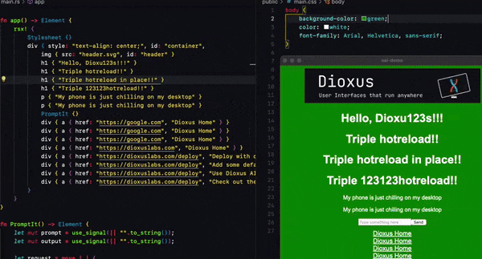

<p>
  <a href="https://dioxuslabs.com">
    <p align="center" >
      
      
      
    </p>
  </a>
</p>
<div align="center">
  <!-- Crates version -->
  <a href="https://crates.io/crates/dioxus">
    
  </a>
  <!-- Downloads -->
  <a href="https://crates.io/crates/dioxus">
    
  </a>
  <!-- docs -->
  <a href="https://docs.rs/dioxus">
    
  </a>
  <!-- CI -->
  <a href="https://github.com/jkelleyrtp/dioxus/actions">
    
  </a>

  <!--Awesome -->
  <a href="https://dioxuslabs.com/awesome">
    
  </a>
  <!-- Discord -->
  <a href="https://discord.gg/XgGxMSkvUM">
    
  </a>
</div>

<div align="center">
  <h3>
    <a href="https://dioxuslabs.com"> Website </a>
    <span> | </span>
    <a href="https://github.com/DioxusLabs/example-projects"> Examples </a>
    <span> | </span>
    <a href="https://dioxuslabs.com/learn/0.4/guide"> Guide </a>
    <span> | </span>
    <a href="https://github.com/DioxusLabs/dioxus/blob/main/translations/zh-cn/README.md"> 中文 </a>
    <span> | </span>
    <a href="https://github.com/DioxusLabs/dioxus/blob/main/translations/pt-br/README.md"> PT-BR </a>
    <span> | </span>
    <a href="https://github.com/DioxusLabs/dioxus/blob/main/translations/ja-jp/README.md"> 日本語 </a>
    <span> | </span>
    <a href="https://github.com/DioxusLabs/dioxus/blob/main/translations/tr-tr"> Türkçe </a>
  </h3>
</div>
<br>


Build for web, desktop, and mobile, and more with a single codebase. Zero-config setup, integrated hotreloading, and signals-based state management help you ship faster and more reliably. Seamlessly add backend functionality with Server Functions and bundle with our CLI.

```rust
fn app() -> Element {
    let mut count = use_signal(|| 0);

    rsx! {
        h1 { "High-Five counter: {count}" }
        button { onclick: move |_| count += 1, "Up high!" }
        button { onclick: move |_| count -= 1, "Down low!" }
    }
}
```

<br>

## ⭐️ Unique features:
- Cross-platform apps in three lines of code (web, desktop, mobile, server, and more)
- [Ergonomic state management](https://dioxuslabs.com/blog/release-050) combines the best of React, Solid, and Svelte
- Extremely performant, powered by Rust's fastest wasm-framework [sledgehammer](https://dioxuslabs.com/blog/templates-diffing)
- Integrated bundler for deploying to the web, macOS, Linux, and Windows
- And more! Read the [take a tour of Dioxus](https://dioxuslabs.com/learn/0.5/).

## ⚙️ Instant hot-reloading
With one command, `dx serve` and your app is running. Edit your markup and styles and see the results in real time. Rust code hotreloading is not yet 1st class, but possible with [hot-lib-reloader](https://docs.rs/hot-lib-reloader/latest/hot_lib_reloader/).

<div align="center">
  
</div>

## 📦 Bundler for deploying to the web and desktop

Simply run `dx bundle` and your app will be built and bundled with maximization optimizations. On the web, take advantage of [`.avif` generation, `.wasm` compression, minification](https://dioxuslabs.com/learn/0.5/reference/assets), and more. Build webapps weighing [less than 50kb](https://github.com/ealmloff/tiny-dioxus/) and desktop/mobile apps less than 15mb.

<div align="center">
  
</div>


## 📖 Fantastic documentation

We've put a ton of effort into building clean, readable, and comprehensive documentation. All html elements and listeners are documented with MDN docs, and our docsite runs continuous integration with Dioxus itself to ensure that the docs are always up to date. Check out the [Dioxus website](https://dioxuslabs.com/learn/0.5/) for guides, references, recipes, and more. Fun fact: we use the Dioxus website as a testbed for new diouxs features - [check it out!](https://github.com/dioxusLabs/docsite)

<div align="center">
  
</div>

## 💻 Emphasis on developer experience

Dioxus prioritizes developer experience, and we've put a ton of effort into end-to-end tooling. We've built a [VSCode extension](https://marketplace.visualstudio.com/items?itemName=DioxusLabs.dioxus) that autoformats your RSX code, converts HTML to RSX, and more. We've also built a very powerful [CLI](https://github.com/DioxusLabs/cli) that supports creating new apps, serving them, and cross-platform bundling, with deployment on the roadmap.

<div align="center">
  
</div>

## 📚 Community

Dioxus is a community-driven project, with a very active [Discord](https://discord.gg/XgGxMSkvUM) and [GitHub](https://github.com/DioxusLabs/dioxus/issues) community. We're always looking for help, and we're happy to answer questions and help you get started. [Our SDK](https://github.com/DioxusLabs/dioxus-std) is community-run and we even have a [GitHub organization](https://github.com/dioxus-community/) for the best Dioxus crates that receive free upgrades and support.

<div align="center">
  
</div>


## 🎉 Full-time core team

Dioxus has grown from a side project to a small team of fulltime engineers. Thanks to the generous support of FutureWei, Satellite.im, the GitHub Accelerator program, and several amazing individuals, we're able to work on Dioxus full-time. Our long term goal is for Dioxus to become self-sustaining by providing paid high-quality enterprise tools. If your company is interested in adopting Dioxus and would like to work with us, please reach out!

## ⚒️ Supported Platforms
<div align="center">
  <table style="width:100%">
    <tr>
      <td>
      <b>Web</b>
      <br />
      <em>Tier 1 Support</em>
      </td>
      <td>
        <ul>
          <li>Render directly to the DOM using WebAssembly</li>
          <li>Pre-render with SSR and rehydrate on the client</li>
          <li>Simple "hello world" at about 65kb, comparable to React</li>
          <li>Built-in dev server and hot reloading for quick iteration</li>
        </ul>
      </td>
    </tr>
    <tr>
      <td>
      <b>Desktop</b>
      <br />
      <em>Tier 1 Support</em>
      </td>
      <td>
        <ul>
          <li>Render using Webview or - experimentally - with WGPU or Skia </li>
          <li>Zero-config setup. Simply cargo-run to build your app </li>
          <li>Full support for native system access without electron-esque IPC </li>
          <li>Supports macOS, Linux, and Windows. Portable <3mb binaries </li>
        </ul>
      </td>
    </tr>
    <tr>
      <td>
      <b>Liveview</b>
      <br />
      <em>Tier 1 Support</em>
      </td>
      <td>
        <ul>
          <li>Render apps - or just a single component - entirely on the server</li>
          <li>Integrations with popular Rust frameworks like Axum and Warp</li>
          <li>Extremely low-latency and ability to support 10,000+ simultaneous apps</li>
        </ul>
      </td>
    </tr>
    <tr>
      <td>
      <b>Mobile</b>
      <br />
      <em>Tier 2 Support</em>
      </td>
      <td>
        <ul>
          <li>Render using Webview or - experimentally - with WGPU or Skia </li>
          <li>Support for iOS and Android </li>
          <li><em>Significantly</em> more performant than React Native </li>
        </ul>
      </td>
    </tr>
    <tr>
      <td>
      <b>Terminal</b>
      <br />
      <em>Tier 2 Support</em>
      </td>
      <td>
        <ul>
          <li>Render apps directly into your terminal, similar to <a href="https://github.com/vadimdemedes/ink"> ink.js</a></li>
          <li>Powered by the familiar flexbox and CSS model of the browser</li>
          <li>Built-in widgets like text input, buttons, and focus system</li>
        </ul>
      </td>
    </tr>
  </table>
</div>

## Dioxus vs other frameworks

We love all frameworks and enjoy watching innovation in the Rust ecosystem. In fact, many of our projects are shared with other frameworks. For example, our flex-box library [Taffy](https://github.com/DioxusLabs/taffy) is used by [Bevy](https://bevyengine.org/), [Zed](https://zed.dev/), [Lapce](https://lapce.dev/), [Iced](https://github.com/iced-rs/iced),  and many more.

Dioxus places an emphasis on a few key points that make it different from other frameworks:

- **React-like**: we rely on concepts like components, props, and hooks to build UIs, with our state management being closer to Svelte than to SolidJS.
- **HTML and CSS**: we lean completely into HTML and CSS, quirks and all.
- **Renderer-agnostic**: you can swap out the renderer for any platform you want thanks to [our fast VirtualDOM](https://dioxuslabs.com/blog/templates-diffing).
- **Collaborative**: whenever possible, we spin out crates like [Taffy](https://github.com/DioxusLabs/taffy), [magnanis](https://github.com/DioxusLabs/collect-assets), [include_mdbook](https://github.com/DioxusLabs/include_mdbook), and [blitz](http://github.com/dioxusLabs/blitz) so the ecosystem can grow together.


### Dioxus vs Tauri

Tauri is a framework for building desktop (and soon, mobile) apps where your frontend is written in a web-based framework like React, Vue, Svelte, etc. Whenever you need to do native work, you can write Rust functions and call them from your frontend.

- **Natively Rust**: Tauri's architecture limits your UI to either JavaScript or WebAssembly. With Dioxus, your Rust code is running natively on the user's machine, letting you do things like spawning threads, accessing the filesystem, without any IPC bridge. This drastically simplifies your app's architecture and makes it easier to build. You can build a Tauri app with Dioxus-Web as a frontend if you'd like.

- **Different scopes**: Tauri needs to support JavaScript and its complex build tooling, limiting the scope of what you can do with it. Since Dioxus is exclusively focused on Rust, we're able to provide extra utilities like Server Functions, advanced bundling, and a native renderer.

- **Shared DNA**: While Tauri and Dioxus are separate projects, they do share libraries like Tao and Wry: windowing and webview libraries maintained by the Tauri team.

### Dioxus vs Leptos

Leptos is a library for building fullstack web-apps, similar to SolidJS and SolidStart. The two libraries share similar goals on the web, but have several key differences:

- **Reactivity model**: Leptos uses signals for its underlying reactivity, while Dioxus opts for a VirtualDom and re-renders. While in theory signals are more efficient, in practice, Dioxus' VirtualDom performs little-to-no actual diffing (thanks to our [block-dom inspired templates](https://dioxuslabs.com/blog/templates-diffing)) and is [actually faster than Leptos](https://krausest.github.io/js-framework-benchmark/2024/table_chrome_123.0.6312.59.html).

- **Control flow**: Because Leptos uses signals for reactivity, you are constrained to Leptos' primitives for things like `for` loops and `if` statements. If you get this wrong, your app will lose reactivity, leading to hard to debug UI issues. With Dioxus, you can use iterators, regular Rust `for` loops and `if` statements, and your app will still be reactive. In practice, a Dioxus component to insert counters into a list might look like this:
```rust
fn Counters() -> Element {
  let mut counters = use_signal(|| vec![0; initial_length]);

  rsx! {
    button { onclick: move |_| counters.push(counters.len()); "Add Counter" }
    ul {
      for idx in 0..counters.len() {
        li {
          button { onclick: move |_| counters[idx] += 1; "{counters[idx]}" }
          button { onclick: move |_| { counters.write().remove(idx); } "Remove" }
        }
      }
    }
  }
}
```
While in Leptos, you would need to track keys, use the `<For>` component, create new signals, and manually clean up memory:
```rust
fn Counters() -> Element {
    let initial_counters = (0..initial_length)
        .map(|id| (id, create_signal(id + 1)))
        .collect::<Vec<_>>();

    let (counters, set_counters) = create_signal(initial_counters);

    let add_counter = move |_| {
        let sig = create_signal(next_counter_id + 1);
        set_counters.update(move |counters| counters.push((next_counter_id, sig)));
        next_counter_id += 1;
    };

    view! {
        <div>
            <button on:click=add_counter>
                "Add Counter"
            </button>
            <ul>
                <For
                    each=counters
                    key=|counter| counter.0
                    children=move |(id, (count, set_count))| {
                        view! {
                            <li>
                                <button
                                    on:click=move |_| set_count.update(|n| *n += 1)
                                >
                                    {count}
                                </button>
                                <button
                                    on:click=move |_| {
                                        set_counters.update(|counters| {
                                            counters.retain(|(counter_id, (signal, _))| {
                                                // NOTE: in this example, we are creating the signals
                                                // in the scope of the parent. This means the memory used to
                                                // store them will not be reclaimed until the parent component
                                                // is unmounted. Here, we're removing the signal early (i.e, before
                                                // the DynamicList is unmounted), so we manually dispose of the signal
                                                // to avoid leaking memory.
                                                //
                                                // This is only necessary in an example with nested signals like this one.
                                                if counter_id == &id {
                                                    signal.dispose();
                                                }
                                                counter_id != &id
                                            })
                                        });
                                    }
                                >
                                    "Remove"
                                </button>
                            </li>
                        }
                    }
                />
            </ul>
        </div>
    }
}
```

- **`Copy` state**: Dioxus 0.1 to 0.4 relied on lifetimes to relax the rules of Rust's borrow checker. This worked well for event handlers, but struggled around async. In Dioxus 0.5, we've switched to a `Copy` state model borrowed from Leptos. You can use our `Copy` state implementation in your own apps using the [generational-box](https://crates.io/crates/generational-box) crate.

- **Different scopes**: Dioxus provides renderers for web, desktop, mobile, LiveView, and more. We also maintain community libraries and a cross-platform SDK. The scope of this work is huge, meaning we've historically released at a slower cadence than Leptos. Leptos focuses on the fullstack web, with features that Dioxus doesn't have like `<Suspense />`-based streaming HTML, islands, `<Form />` components, and other web-specific features. Generally, web apps you build with Leptos will have a smaller footprint.

- **Different DSLs**: While both frameworks target the web, Dioxus uses its own custom Rust-like DSL for building UIs while Leptos uses a more HTML-like syntax. We chose this to retain compatibility with IDE features like codefolding and syntax highlighting. Generally, Dioxus leans into more "magic" with its DSL. For example, dioxus will automatically format strings for you while Leptos requires you to use closures and `format!` or `format_args!`.
```rust
// dioxus
rsx! {
  div { class: "my-class", enabled: true, "Hello, {name}" }
}

// leptos
view! {
  <div class="my-class" enabled={true}>
    "Hello "
    {move || name()}
  </div>
}
```

### Dioxus vs Yew

Yew is a framework for building single-page web apps and initially served as an inspiration for Dioxus. Unfortunately, the architecture of Yew didn't support the various features we wanted, and thus Dioxus was born.

- **Single-page apps**: Yew is designed exclusively for single-page web apps and is instrinsically tied to the web platform. Dioxus is fullstack and crossplatform, making it suitable for building web, desktop, mobile, and server apps.

- **Developer Tooling**: Dioxus provides a number of utilities like autoformatting, hotreloading, and a bundler.

- **Ongoing support**: Dioxus is very actively maintained with new features and bug fixes being added on a daily basis.

### Dioxus vs egui

egui is a cross-platform GUI library for Rust powering tools like [Rerun.io](https://www.rerun.io).

- **Immediate vs Retained**: egui is designed to be re-rendered on every frame. This is suitable for games and other interactive applications, but it does not retain style and layout state between frames. Dioxus is a retained UI framework, meaning that the UI is built once and then modified between frames. This enables Dioxus to use native web technologies like HTML and CSS with better battery life and performance.

- **Customizable**: egui brings its own styling and layout solution while Dioxus expects you to use the built-in HTML and CSS. This enables dioxus apps to use any CSS library like Tailwind or Material UI.

- **State management**: egui's state management is based on a single global state object. Dioxus encourages encapsulation of state by using signals and components components more reusable.

### Dioxus vs Iced

Iced is a cross-platform GUI library inspired by Elm. Iced renders natively with WGPU and supports the web using DOM nodes.

- **Elm state management**: Iced uses Elm's state management model, which is based on message passing and reducers. This is simply a different state management model than Dioxus and can be rather verbose at times.

- **Native Feel**: Since Dioxus uses a webview as its renderer, it automatically gets native text input, paste handling, and other native features like accessibility. Iced's renderer currently doesn't implement these features, making it feel less native.


### Dioxus vs Electron

Dioxus and Electron are two entirely different projects with similar goals. Electron makes it possible for developers to build cross-platform desktop apps using web technologies like HTML, CSS, and JavaScript.

- **Lightweight**: Dioxus uses the system's native WebView - or optionally, a WGPU renderer - to render the UI. This makes a typical Dioxus app about 15mb on macOS in comparison to Electron's 100mb. Electron also ships an embedded chromium instance which cannot share system resources with the host OS in the same way as Dioxus.


## Contributing
- Check out the website [section on contributing](https://dioxuslabs.com/learn/0.4/contributing).
- Report issues on our [issue tracker](https://github.com/dioxuslabs/dioxus/issues).
- [Join](https://discord.gg/XgGxMSkvUM) the discord and ask questions!


<a href="https://github.com/dioxuslabs/dioxus/graphs/contributors">
  
</a>

## License
This project is licensed under the [MIT license].

[mit license]: https://github.com/DioxusLabs/dioxus/blob/master/LICENSE-MIT

Unless you explicitly state otherwise, any contribution intentionally submitted
for inclusion in Dioxus by you, shall be licensed as MIT, without any additional
terms or conditions.
