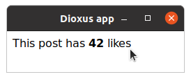
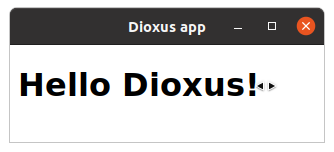

# Component Props

Just like you can pass arguments to a function, you can pass props to a component that customize its behavior! The components we've seen so far didn't accept any props – so let's write some components that do.

## `#[derive(Props)]`

Component props are a single struct annotated with `#[derive(Props)]`. For a component to accept props, the type of its argument must be `Scope<YourPropsStruct>`. Then, you can access the value of the props using `cx.props`.

> Note: By default, the props are `()`, which is why our previous components didn't need any props.
> 
>```rust
>// this scope
>Scope<()>
>
>// is the same as this scope
>Scope
>```

There are 2 flavors of Props structs:
- Owned props:
  - Don't have an associated lifetime
  - Implement `PartialEq`, allowing for memoization (if the props don't change, Dioxus won't re-render the component)
- Borrowed props:
  - [Borrow](https://doc.rust-lang.org/beta/rust-by-example/scope/borrow.html) from a parent component
  - Cannot be memoized due to lifetime constraints


### Owned Props

Owned Props are very simple – they don't borrow anything. Example:

```rust
{{#include ../../examples/component_owned_props.rs:Likes}}
```

You can then pass prop values to the component the same way you would pass attributes to an element:
```rust
{{#include ../../examples/component_owned_props.rs:App}}
```



### Borrowed Props

Owning props works well if your props are easy to copy around - like a single number. But what if we need to pass a larger data type, like a String from an `App` Component to a `TitleCard` subcomponent? A naive solution might be to [`.clone()`](https://doc.rust-lang.org/std/clone/trait.Clone.html) the String, creating a copy of it for the subcomponent – but this would be inefficient, especially for larger Strings.

Rust allows for something more efficient – borrowing the String as a `&str`. Instead of creating a copy, this will give us a reference to the original String – this is what Borrowed Props are for!

```rust
{{#include ../../examples/component_borrowed_props.rs:TitleCard}}
```

We can pass borrowed props by borrowing a value from, e.g. a String:

```rust
{{#include ../../examples/component_borrowed_props.rs:App}}
```



---

> Dioxus `Props` is very similar to [@idanarye](https://github.com/idanarye)'s [TypedBuilder crate](https://github.com/idanarye/rust-typed-builder) and supports many of the same parameters.


## Optional Props

You can easily create optional fields by using the `Option<…>` type for a field:

```rust
#[derive(Props, PartialEq)]
struct MyProps {
    name: String,

    description: Option<String>
}

fn Demo(cx: MyProps) -> Element {
    let text = match cx.props.description {
        Some(d) => d,             // if a value is provided
        None => "No description"  // if the prop is omitted
    };

    cx.render(rsx! {
        "{name}": "{text}"
    })
}
```
In this example `name` is a required prop and `description` is optional.
This means we can completely omit the description field when calling the component:

```rust
rsx!{
    Demo {
        name: "Thing".to_string(),
        // description is omitted
    }
}
```
Additionally if we provide a value we don't have to wrap it with `Some(…)`. This is done automatically for us:

```rust
rsx!{
    Demo {
        name: "Thing".to_string(),
        description: "This is explains it".to_string(),
    }
}
```

If you want to make a prop required even though it is of type `Option` you can provide the `!optional` modifier:

```rust
#[derive(Props, PartialEq)]
struct MyProps {
    name: String,

    #[props(!optional)]
    description: Option<String>
}
```

This can be especially useful if you have a type alias named `Option` in the current scope.

For more information on how tags work, check out the [TypedBuilder](https://github.com/idanarye/rust-typed-builder) crate. However, all attributes for props in Dioxus are flattened (no need for `setter` syntax) and the `optional` field is new. The `optional` modifier is a combination of two separate modifiers: `default` and `strip_option` and it is automatically detected on `Option<…>` types.

The full list of Dioxus' modifiers includes:

- `default` - automatically add the field using its `Default` implementation
- `optional` - alias for `default` and `strip_option`
- `into` - automatically call `into` on the value at the callsite


## The `inline_props` macro

So far, every Component function we've seen had a corresponding ComponentProps struct to pass in props. This was quite verbose... Wouldn't it be nice to have props as simple function arguments? Then we wouldn't need to define a Props struct, and instead of typing `cx.props.whatever`, we could just use `whatever` directly!

`inline_props` allows you to do just that. Instead of typing the "full" version:

```rust
#[derive(Props, PartialEq)]
struct TitleCardProps {
    title: String,
}

fn TitleCard(cx: Scope<TitleCardProps>) -> Element {
    cx.render(rsx!{
        h1 { "{cx.props.title}" }
    })
}
```

...you can define a function that accepts props as arguments. Then, just annotate it with `#[inline_props]`, and the macro will turn it into a regular Component for you:

```rust
#[inline_props]
fn TitleCard(cx: Scope, title: String) -> Element {
    cx.render(rsx!{
        h1 { "{title}" }
    })
}
```

> While the new Component is shorter and easier to read, this macro should not be used by library authors since you have less control over Prop documentation.
