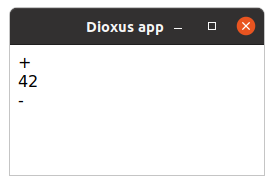
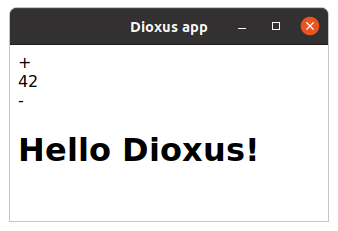

# Component Properties

Dioxus components are functions that accept Props as input and output an Element. In fact, the `App` function you saw in the previous chapter was a component with no Props! Most components, however, will need to take some Props to render something useful – so, in this section, we'll learn about props:

- Deriving the Props trait
- Memoization through PartialEq
- Optional fields on props
- The inline_props macro

## Props

The input of your Component must be passed in a single struct, which must implement the `Props` trait. We can derive this trait automatically with `#[derive(Props)]`.

> Dioxus `Props` is very similar to [@idanarye](https://github.com/idanarye)'s [TypedBuilder crate](https://github.com/idanarye/rust-typed-builder) and supports many of the same parameters.

There are 2 flavors of Props: owned and borrowed.

- All Owned Props must implement `PartialEq`
- Borrowed props [borrow](https://doc.rust-lang.org/beta/rust-by-example/scope/borrow.html) values from the parent Component

### Owned Props

Owned Props are very simple – they don't borrow anything. Example:
```rust
// Remember: owned props must implement PartialEq!
#[derive(PartialEq, Props)]
struct VoteButtonProps {
    score: i32
}

fn VoteButton(cx: Scope<VoteButtonProps>) -> Element {
    cx.render(rsx!{
        div {
            div { "+" }
            div { "{cx.props.score}"}
            div { "-" }
        }
    })
}
```

Now, we can use the VoteButton Component like we would use a regular HTML element:

```rust
fn main() {
    dioxus::desktop::launch(App);
}

fn App(cx: Scope) -> Element {
    cx.render(rsx! (
        VoteButton { score: 42 }
    ))
}
```

And we can see that the Component indeed gets rendered:



> The simplest Owned Props you can have is `()` - or no value at all. This is what the `App` Component takes as props. `Scope` accepts a generic for the Props which defaults to `()`.
>
> ```rust
>// this scope
>Scope<()>
>
>// is the same as this scope
>Scope
>```

### Borrowed Props

Owning props works well if your props are easy to copy around - like a single number. But what if we need to pass a larger data type, like a String from an `App` Component to a `TitleCard` subcomponent? A naive solution might be to [`.clone()`](https://doc.rust-lang.org/std/clone/trait.Clone.html) the String, creating a copy of it for the subcomponent – but this would be inefficient, especially for larger Strings.

Rust allows for something more efficient – borrowing the String as a `&str`. Instead of creating a copy, this will give us a reference to the original String – this is what Borrowed Props are for!

However, if we create a reference a String, Rust will require us to show that the String will not go away while we're using the reference. Otherwise, if we referenced something that doesn't exist, Bad Things could happen. To prevent this, Rust asks us to define a lifetime for the reference:

```rust
#[derive(Props)]
struct TitleCardProps<'a> {
    title: &'a str,
}

fn TitleCard<'a>(cx: Scope<'a, TitleCardProps<'a>>) -> Element {
    cx.render(rsx!{
        h1 { "{cx.props.title}" }
    })
}
```

This lifetime `'a` tells the compiler that as long as `title` exists, the String it was created from must also exist. Dioxus will happily accept such a component – we can now render it alongside our VoteButton!

```rust
fn App(cx: Scope) -> Element {
    // For the sake of an example, we create the &str here.
    // But you might as well borrow it from an owned String type.
    let hello = "Hello Dioxus!";

    cx.render(rsx! (
        VoteButton { score: 42 },
        TitleCard { title: hello }
    ))
}
```


## Memoization

Dioxus uses Memoization for a more efficient user interface. Memoization is the process in which we check if a component actually needs to be re-rendered when its props change. If a component's properties change but they wouldn't affect the output, then we don't need to re-render the component, saving time!

For example, let's say we have a component that has two children:

```rust
fn Demo(cx: Scope) -> Element {
    // don't worry about these 2, we'll cover them later
    let name = use_state(&cx, || String::from("bob"));
    let age = use_state(&cx, || 21);

    cx.render(rsx!{
        Name { name: name }
        Age { age: age }
    })
}
```

If `name` changes but `age` does not, then there is no reason to re-render our `Age` component since the contents of its props did not meaningfully change.

Dioxus memoizes owned components. It uses `PartialEq` to determine if a component needs rerendering, or if it has stayed the same. This is why you must derive PartialEq!

> This means you can always rely on props with `PartialEq` or no props at all to act as barriers in your app. This can be extremely useful when building larger apps where properties frequently change. By moving our state into a global state management solution, we can achieve precise, surgical re-renders, improving the performance of our app.

Borrowed Props cannot be safely memoized. However, this is not a problem – Dioxus relies on the memoization of their parents to determine if they need to be rerendered.

## Optional Props

You can easily create optional fields by using the `Option<…>` type for a field:

```rust
#[derive(Props, PartialEq)]
struct MyProps {
    name: String,

    description: Option<String>
}

fn Demo(cx: MyProps) -> Element {
    let text = match cx.props.description {
        Some(d) => d,             // if a value is provided
        None => "No description"  // if the prop is omitted
    };

    cx.render(rsx! {
        "{name}": "{text}"
    })
}
```
In this example `name` is a required prop and `description` is optional.
This means we can completely omit the description field when calling the component:

```rust
rsx!{
    Demo {
        name: "Thing".to_string(),
        // description is omitted
    }
}
```
Additionally if we provide a value we don't have to wrap it with `Some(…)`. This is done automatically for us:

```rust
rsx!{
    Demo {
        name: "Thing".to_string(),
        description: "This is explains it".to_string(),
    }
}
```

If you want to make a prop required even though it is of type `Option` you can provide the `!optional` modifier:

```rust
#[derive(Props, PartialEq)]
struct MyProps {
    name: String,

    #[props(!optional)]
    description: Option<String>
}
```

This can be especially useful if you have a type alias named `Option` in the current scope.

For more information on how tags work, check out the [TypedBuilder](https://github.com/idanarye/rust-typed-builder) crate. However, all attributes for props in Dioxus are flattened (no need for `setter` syntax) and the `optional` field is new. The `optional` modifier is a combination of two separate modifiers: `default` and `strip_option` and it is automatically detected on `Option<…>` types.

The full list of Dioxus' modifiers includes:

- `default` - automatically add the field using its `Default` implementation
- `optional` - alias for `default` and `strip_option`
- `into` - automatically call `into` on the value at the callsite


## The `inline_props` macro

So far, every Component function we've seen had a corresponding ComponentProps struct to pass in props. This was quite verbose... Wouldn't it be nice to have props as simple function arguments? Then we wouldn't need to define a Props struct, and instead of typing `cx.props.whatever`, we could just use `whatever` directly!

`inline_props` allows you to do just that. Instead of typing the "full" version:

```rust
#[derive(Props, PartialEq)]
struct TitleCardProps {
    title: String,
}

fn TitleCard(cx: Scope<TitleCardProps>) -> Element {
    cx.render(rsx!{
        h1 { "{cx.props.title}" }
    })
}
```

...you can define a function that accepts props as arguments. Then, just annotate it with `#[inline_props]`, and the macro will turn it into a regular Component for you:

```rust
#[inline_props]
fn TitleCard(cx: Scope, title: String) -> Element {
    cx.render(rsx!{
        h1 { "{title}" }
    })
}
```

> While the new Component is shorter and easier to read, this macro should not be used by library authors since you have less control over Prop documentation.
