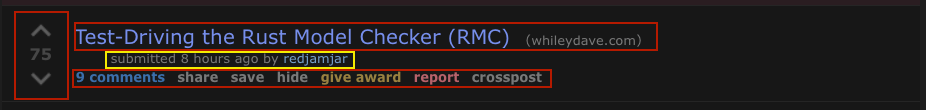

# Introduction to Components

In the previous chapter, we learned about Elements and how they can be composed to create a basic User Interface. In this chapter, we'll learn how to group Elements together to form Components.

In this chapter, we'll learn:
- What makes a Component
- How to model a component and its properties in Dioxus
- How to "think declaratively"

## What is a component?

In short, a component is a special function that takes input properties and outputs an Element. Typically, Components serve a single purpose: group functionality of a User Interface. Much like a function encapsulates some specific computation task, a Component encapsulates some specific rendering task.

### Learning through prior art

Let's take a look at a post on r/rust and see if we can sketch out a component representation.


This component has a bunch of important information:

- The score
- The number of comments
- How long ago it was posted
- The url short address
- The title
- The username of the original poster

If we wanted to sketch out these requirements in Rust, we would start with a struct:

```rust
struct PostData {
    score: i32,
    comment_count: u32,
    post_time: Instant,
    url: String,
    title: String,
    original_poster_name: String
}
```

If we look at the layout of the component, we notice quite a few buttons and pieces of functionality:

- Upvote/Downvote
- View comments
- Share
- Save
- Hide
- Give award
- Report
- Crosspost
- Filter by site
- View article
- Visit user

If we included all this functionality in one `rsx!` call it would be huge! Instead, let's break the post down into some core pieces:



- **VoteButton**: Upvote/Downvote
- **TitleCard**: Title, Filter-By-Url
- **MetaCard**: Original Poster, Time Submitted
- **ActionCard**: View comments, Share, Save, Hide, Give award, Report, Crosspost

### Modeling with Dioxus

We can start by sketching out the Element hierarchy using Dioxus. In general, our "Post" component will be comprised of the four sub-components listed above. First, let's define our `Post` component.

Unlike normal functions, Dioxus components must explicitly define a single struct to contain all the inputs. These are commonly called "Properties" (props). Our component will be a combination of these properties and a function to render them.

Our props must implement the `Props` trait and - if the component does not borrow any data - `PartialEq`. Both of these can be done automatically through derive macros:
```rust
#[derive(Props, PartialEq)]
struct PostProps {
    id: Uuid,
    score: i32,
    comment_count: u32,
    post_time: Instant,
    url: String,
    title: String,
    original_poster: String
}
```

And our render function:
```rust
fn Post(cx: Scope<PostProps>) -> Element {
    cx.render(rsx!{
        div { class: "post-container"
            VoteButton {
                score: cx.props.score,
            }
            TitleCard {
                title: cx.props.title,
                url: cx.props.url,
            }
            MetaCard {
                original_poster: cx.props.original_poster,
                post_time: cx.props.post_time,
            }
            ActionCard {
                post_id: cx.props.id
            }
        }
    })
}
```

When declaring a component in `rsx!`, we can pass in properties using the traditional Rust struct syntax. Our `Post` component is simply a collection of smaller components wrapped together in a single container.

Let's take a look at the `VoteButton` component. For now, we won't include any interactivity - just the rendering the score and buttons to the screen.

Most of your Components will look exactly like this: a Props struct and a render function. Every component must take a `Scope` generic over some `Props` and return an `Element`.

As covered before, we'll build our User Interface with the `rsx!` macro and HTML tags. However, with components, we must actually "render" our HTML markup. Calling `cx.render` converts our "lazy" `rsx!` structure into an `Element`.

```rust
#[derive(PartialEq, Props)]
struct VoteButtonProps {
    score: i32
}

fn VoteButton(cx: Scope<VoteButtonProps>) -> Element {
    cx.render(rsx!{
        div { class: "votebutton"
            div { class: "arrow up" }
            div { class: "score", "{cx.props.score}"}
            div { class: "arrow down" }
        }
    })
}
```

## Borrowing

You can avoid clones by using borrowed component syntax. For example, let's say we passed the `TitleCard` title as an `&str` instead of `String`. In JavaScript, the string would be copied by reference - none of the contents would be copied, but rather the reference to the string's contents are copied. In Rust, this would be similar to calling `clone` on `Rc<str>`.

Because we're working in Rust, we can choose to either use `Rc<str>`, clone `Title` on every re-render of `Post`, or simply borrow it. In most cases, you'll just want to let `Title` be cloned.

To enable borrowed values for your component, we need to add a lifetime to let the Rust compiler know that the output `Element` borrows from the component's props.

```rust
#[derive(Props)]
struct TitleCardProps<'a> {
    title: &'a str,
}

fn TitleCard<'a>(cx: Scope<'a, TitleCardProps<'a>>) -> Element {
    cx.render(rsx!{
        h1 { "{cx.props.title}" }
    })
}
```

For users of React: Dioxus knows *not* to memoize components that borrow property fields. By default, every component in Dioxus is memoized. This can be disabled by the presence of a non-`'static` borrow.

This means that during the render process, a newer version of `TitleCardProps` will never be compared with a previous version, saving some clock cycles.

## The inline_props macro

Yes - *another* macro! However, this one is entirely optional.

For internal components, we provide the `inline_props` macro, which will let you embed your `Props` definition right into the function arguments of your component.

Our title card above would be transformed from:

```rust
#[derive(Props, PartialEq)]
struct TitleCardProps {
    title: String,
}

fn TitleCard(cx: Scope<TitleCardProps>) -> Element {
    cx.render(rsx!{
        h1 { "{cx.props.title}" }
    })
}
```

to:

```rust
#[inline_props]
fn TitleCard(cx: Scope, title: String) -> Element {
    cx.render(rsx!{
        h1 { "{title}" }
    })
}
```

Again, this macro is optional and should not be used by library authors since you have less fine-grained control over documentation and optionality.

However, it's great for quickly throwing together an app without dealing with *any* extra boilerplate.

## The `Scope` object

Though very similar to React, Dioxus is different in a few ways. Most notably, React components will not have a `Scope` parameter in the component declaration.

Have you ever wondered how the `useState()` call works in React without a `this` object to actually store the state?

React uses global variables to store this information. Global mutable variables must be carefully managed and are broadly discouraged in Rust programs.

```javascript
function Component(props) {
    let [state, set_state] = useState(10);
}
```


Because Dioxus needs to work with the rules of Rust it uses the `Scope` object to maintain some internal bookkeeping. That's what the `Scope` object is: a place for the component to store state, manage listeners, and allocate elements. Advanced users of Dioxus will want to learn how to properly leverage the `Scope` object to build robust and performant extensions for Dioxus.

```rust
fn Post(cx: Scope<PostProps>) -> Element {
    cx.render(rsx!("hello"))
}
```
## Moving forward

Next chapter, we'll talk about composing Elements and Components across files to build a larger Dioxus App.

For more references on components, make sure to check out:

- [Components in depth]()
- [Lifecycles]()
- [The Scope object]()
- [Optional Prop fields]()

