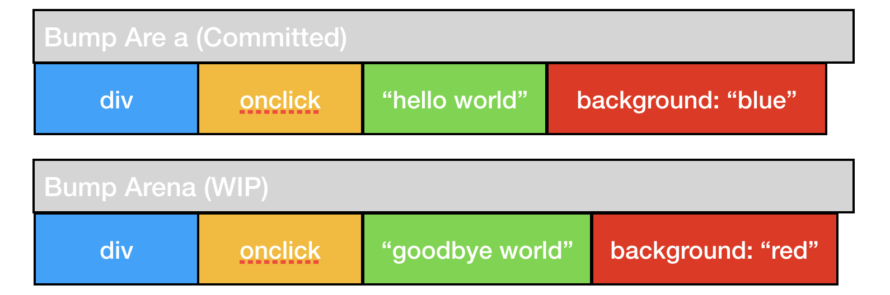

# Thinking in React

We've finally reached the point in our tutorial where we can talk about the "Theory of React." We've talked about defining a declarative view, but not about the aspects that make our code *reactive*.

Understanding the theory of reactive programming is essential to making sense of Dioxus and writing effective, performant UIs.

In this section, we'll talk about:

- One-way data flow
- Modifying data
- Forcing renders
- How renders propagate

This section is a bit long, but worth the read. We recommend coffee, tea, and/or snacks.

## Reactive Programming

Dioxus is one the very few Rust libraries that provide a "Reactive Programming Model". The term "Reactive programming" is a classification of programming paradigm - much like functional or imperative programming. This is a very important distinction since it affects how we *think* about our code.

Reactive programming is a programming model concerned with deriving computations from asynchronous data flow. Most reactive programs are comprised of datasources, intermediate computations, and a final result.

We consider the rendered GUI to be the final result of our Dioxus apps. The datasources for our apps include local and global state.

For example, the model presented in the figure below is comprised of two data sources: time and a constant. These values are passed through our computation graph to achieve a final result: `g`.


Whenever our `seconds` variable changes, we will then reevaluate the computation for `t`. Because `g` relies on `t`, we will also reevaluate its computation too. Notice that we would've reevaluated the computation for `g` even if `t` didn't change because `seconds` is used to calculate `g`.

However, if we somehow changed our constant from `1` to `2`, then we need to reevaluate `t`. If, for whatever reason, this change did not affect the result of `t`, then we wouldn't try to reevaluate `g`.

In Reactive Programming, we don't think about whether or not we should reevaluate `t` or `g`; instead, we simply provide functions of computation and let the framework figure out the rest for us.

In Rust, our reactive app would look something like:

```rust
fn compute_g(t: i32, seconds: i32) -> bool {
    t > seconds
}

fn compute_t(constant: i32, seconds: i32) -> i32 {
    constant + seconds
}

fn compute_graph(constant: i32, seconds: i32) -> bool {
    let t = compute_t(constant, seconds);
    let g = compute_g(t, seconds);
    g
}
```

## How is Dioxus Reactive?

The Dioxus VirtualDom provides us a framework for reactive programming. When we build apps with dioxus, we need to provide our own datasources. This can be either initial props or some values fetched from the network. We then pass this data through our app into components through properties. 

If we represented the reactive graph presented above in Dioxus, it would look very similar:

```rust
// Declare a component that holds our datasources and calculates `g`
fn RenderGraph(cx: Scope) -> Element {
    let seconds = use_datasource(SECONDS);
    let constant = use_state(&cx, || 1);

    cx.render(rsx!( 
        RenderG { seconds: seconds } 
        RenderT { seconds: seconds, constant: constant }
    ))
}

// "calculate" g by rendering `t` and `seconds`
#[inline_props]
fn RenderG(cx: Scope, seconds: i32) -> Element {
    cx.render(rsx!{ "There are {seconds} seconds remaining..." })
}

// calculate and render `t` in its own component
#[inline_props]
fn RenderT(cx: Scope, seconds: i32, constant: i32) -> Element {
    let res = seconds + constant;
    cx.render(rsx!{ "{res}" })
}
```

With this app, we've defined three components. Our top-level component provides our datasources (the hooks), computation nodes (child components), and a final value (what's "rendered").

Now, whenever the `constant` changes, our `RenderT` component will be re-rendered. However, if `seconds` doesn't change, then we don't need to re-render `RenderG` because the input is the same. If `seconds` *does* change, then both RenderG and RenderT will be reevaluated.

Dioxus is "Reactive" because it provides this framework for us. All we need to do is write our own tiny units of computation and Dioxus figures out which components need to be reevaluated automatically.

These extra checks and algorithms add some overhead, which is why you see projects like [Sycamore](http://sycamore-rs.netlify.app) and [SolidJS](http://solidjs.com) eliminating them altogether. Dioxus is *really* fast, so we're willing to exchange the added overhead for improved developer experience.

## How do we update values in our dataflow graph?

Dioxus will automatically figure out how to regenerate parts of our app when datasources change. But how exactly can we update our data sources?

In Dioxus there are two datasources:

1. Local state in `use_hook` and all other hooks
2. Global state through `provide_context`.

Technically, the root props of the VirtualDom are a third datasource, but since we cannot modify them, they are not worth talking about.

### Local State

For local state in hooks, Dioxus gives us the `use_hook` method which returns an `&mut T` without any requirements. This means raw hook values are not tracked by Dioxus. In fact, we could write a component that modifies a hook value directly:

```rust
fn app(cx: Scope) -> Element {
    let mut count = cx.use_hook(|_| 0);
    cx.render(rsx!{
        button { 
            onclick: move |_| *count += 1, 
            "Count: {count}"
        }
    })
}
```

However, when this value is written to, the component does not know to be reevaluated. We must explicitly tell Dioxus that this component is "dirty" and needs to be re-rendered. This is done through the `cx.needs_update` method:

```rust
button { 
    onclick: move |_| {
        *count += 1;
        cx.needs_update();
    }, 
    "Count: {count}"
}
```

Now, whenever we click the button, the value will change and the component will be re-rendered.

> Re-rendering is when Dioxus calls your function component *again*. Component functions will be called over and over throughout their lifetime, so they should be mostly side-effect free.

### Understand this!

Your component functions will be called ("rendered" in our lingo) for as long as the component is present in the tree.

A single component will be called multiple times, modifying its own internal state or rendering new nodes with new values from its properties.

### App-Global State

With the `provide_context` and `consume_context` methods on `Scope`, we can share values to descendants without having to pass values through component props. This has the side-effect of making our datasources less obvious from a high-level perspective, but it makes our components more modular within the same codebase.

To make app-global state easier to reason about, Dioxus makes all values provided through `provide_context` immutable. This means any library built on top of `provide_context` needs to use interior mutability to modify shared global state.

In these cases, App-Global state needs to manually track which components need to be re-generated. 

To regenerate *any* component in your app, you can get a handle to the Dioxus' internal scheduler through `schedule_update_any`:

```rust
let force_render = cx.schedule_update_any();

// force a render of the root component
force_render(ScopeId(0));
```

## What does it mean for a component to "re-render"?

In our guides, we frequently use the phrase "re-render" to describe updates to our app. You'll often hear this paired with "preventing unnecessary re-renders." But what exactly does this mean?

When we call `dioxus::desktop::launch`, Dioxus will create a new `Scope` object and call the component we gave it. Our `rsx!` calls will create new nodes which we return back to the VirtualDom. Dioxus will then look through these nodes for child components, call their functions, and so on until every component has been "rendered." We consider these nodes "rendered" because they were created because of our explicit actions.

The tree of UI that dioxus creates will roughly look like the tree of components presented earlier:


But what happens when we call `needs_update` after modifying some important state? Well, if Dioxus called our component's function again, then we would produce new, different nodes. In fact, this is exactly what Dioxus does! 

At this point, we have some old nodes and some new nodes. Again, we call this "rendering" because Dioxus had to create new nodes because of our explicit actions. Any time new nodes get created, our VirtualDom is being "rendered."

These nodes are stored in an extremely efficient memory allocator called a "bump arena." For example, a div with a handler and attribute would be stored in memory in two locations: the "old" tree and the "new" tree.



From here, Dioxus computes the difference between these trees and updates the Real DOM to make it look like the new version of what we've declared.


## Suppressing Renders

So, we know how to make Dioxus render, but how do we *stop* it? What if we *know* that our state didn't change and we shouldn't render and diff new nodes because they'll be exactly the same as the last time?

In these cases, you want to reach for *memoization*. In Dioxus, memoization involves preventing a component from rendering again if its props didn't change since the last time it attempted to render.

Visually, you can tell that a component will only re-render if the new value is sufficiently different than the old one.

| props.val | re-render |
| --------- | --------- |
| 10        | true      |
| 20        | true      |
| 20        | false     |
| 20        | false     |
| 10        | true      |
| 30        | false     |

This is why when you `derive(Props)`, you must also implement the `PartialEq` trait. To override the memoization strategy for a component, you can simply implement your own PartialEq.

```rust
struct CustomProps {
    val: i32,
}

impl PartialEq for CustomProps {
    fn partial_eq(&self, other: &Self) -> bool {
        // we don't render components that have a val less than 5
        if other.val > 5 && self.val > 5{
            self.val == other.val
        }
    }
}
```

However, for components that borrow data, it doesn't make sense to implement PartialEq since the actual references in memory might be different.

You can technically override this behavior by implementing the `Props` trait manually, though it's unsafe and easy to mess up:

```rust
impl Properties for CustomProps {
    fn memoize(&self, other &Self) -> bool {
        self != other
    }
}
```

TLDR:
- Dioxus checks if props changed between renders
- If props changed according to PartialEq, Dioxus re-renders the component
- Props that have a lifetime (ie `<'a>`) will always be re-rendered

## Wrapping Up

Wow, that was a lot of material!

Let's see if we can recap what was presented:

- Reactive programming calculates a final value from datasources and computation
- Dioxus is "reactive" since it figures out which computations to check
- `schedule_update` must be called to mark a component as dirty
- dirty components will be re-rendered (called multiple times) to produce a new UI
- Renders can be suppressed with memoization

This theory is crucial to understand how to compose components and how to control renders in your app.
