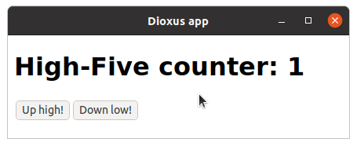
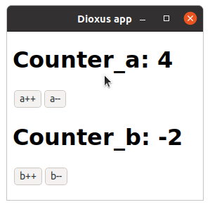

# Hooks and Component State

So far our components have had no state like a normal rust functions. However, in a UI component, it is often useful to have stateful functionality to build user interactions. For example, you might want to track whether the user has opened a drop-down, and render different things accordingly.

Hooks allow us to create state in our components. Hooks are Rust functions that take a reference to `ScopeState` (in a component, you can pass `cx`), and provide you with functionality and state.

## `use_state` Hook

[`use_state`](https://docs.rs/dioxus/latest/dioxus/prelude/fn.use_state.html) is one of the simplest hooks.

- You provide a closure that determines the initial value
- `use_state` gives you the current value, and a way to update it by setting it to something else
- When the value updates, `use_state` makes the component re-render, and provides you with the new value

For example, you might have seen the counter example, in which state (a number) is tracked using the `use_state` hook:

```rust
{{#include ../../../examples/hooks_counter.rs:component}}
```


Every time the component's state changes, it re-renders, and the component function is called, so you can describe what you want the new UI to look like. You don't have to worry about "changing" anything – just describe what you want in terms of the state, and Dioxus will take care of the rest!

> `use_state` returns your value wrapped in a smart pointer of type [`UseState`](https://docs.rs/dioxus/latest/dioxus/prelude/struct.UseState.html). This is why you can both read the value and update it, even within an event handler.

You can use multiple hooks in the same component if you want:

```rust
{{#include ../../../examples/hooks_counter_two_state.rs:component}}
```


## Rules of Hooks

The above example might seem a bit magic, since Rust functions are typically not associated with state. Dioxus allows hooks to maintain state across renders through a reference to `ScopeState`, which is why you must pass `&cx` to them.

But how can Dioxus differentiate between multiple hooks in the same component? As you saw in the second example, both `use_state` functions were called with the same parameters, so how come they can return different things when the counters are different?

```rust
{{#include ../../../examples/hooks_counter_two_state.rs:use_state_calls}}
```

This is only possible because the two hooks are always called in the same order, so Dioxus knows which is which. Because the order you call hooks matters, you must follow certain rules when using hooks:

1. Hooks may be only used in components or other hooks (we'll get to that later)
2. On every call to the component function
   1. The same hooks must be called
   2. In the same order
3. Hooks name's should start with `use_` so you don't accidentally confuse them with regular functions

These rules mean that there are certain things you can't do with hooks:

### No Hooks in Conditionals
```rust
{{#include ../../../examples/hooks_bad.rs:conditional}}
```

### No Hooks in Closures
```rust
{{#include ../../../examples/hooks_bad.rs:closure}}
```

### No Hooks in Loops
```rust
{{#include ../../../examples/hooks_bad.rs:loop}}
```

## `use_ref` Hook

`use_state` is great for tracking simple values. However, you may notice in the [`UseState` API](https://docs.rs/dioxus/latest/dioxus/hooks/struct.UseState.html) that the only way to modify its value is to replace it with something else (e.g., by calling `set`, or through one of the `+=`, `-=` operators). This works well when it is cheap to construct a value (such as any primitive). But what if you want to maintain more complex data in the components state?

For example, suppose we want to maintain a `Vec` of values. If we stored it with `use_state`, the only way to add a new value to the list would be to create a new `Vec` with the additional value, and put it in the state. This is expensive! We want to modify the existing `Vec` instead.

Thankfully, there is another hook for that, `use_ref`! It is similar to `use_state`, but it lets you get a mutable reference to the contained data.

Here's a simple example that keeps a list of events in a `use_ref`. We can acquire write access to the state with `.with_mut()`, and then just `.push` a new value to the state:

```rust
{{#include ../../../examples/hooks_use_ref.rs:component}}
```

> The return values of `use_state` and `use_ref` (`UseState` and `UseRef`, respectively) are in some ways similar to [`Cell`](https://doc.rust-lang.org/std/cell/) and [`RefCell`](https://doc.rust-lang.org/std/cell/struct.RefCell.html) – they provide interior mutability. However, these Dioxus wrappers also ensure that the component gets re-rendered whenever you change the state.

