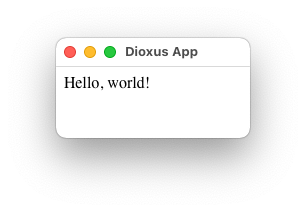

# Aplicativo de Desktop: "Hello, World"

Vamos fazer um aplicativo "hello world" de Desktop simples para nos familiarizar com o Dioxus.

Neste capítulo, nós cobriremos:

- Iniciando um novo projeto Dioxus com o Cargo
- Adicionando o Dioxus como uma dependência
- Lançando nosso primeiro componente como aplicativo raiz

### Um novo projecto utilizando o Cargo

Primeiramente, vamos começar um novo projeto. Em Rust temos os conceitos de executável e biblioteca. Executáveis têm `main.rs` e bibliotecas tem `lib.rs`. Um projeto pode ter ambos. Nosso "hello world" será um executável - nós esperamos que nosso aplicativo seja executado ao ser iniciado. Cargo providencia isso para nós:

```shell
$ cargo new --bin hello-dioxus
```

Agora nós podemos acessar `cd` no nosso projeto e bisbilhotar:

```shell
$ cd hello-dioxus
$ tree
.
├── Cargo.toml
├── .git
├── .gitignore
└── src
    └── main.rs
```

Nós estamos sendo saudados com uma repositório git pre-inicializado, nossa pasta fonte (`src`) e nosso projeto (`Cargo.toml`).

Nossa pasta `src` contém nosso código. Nosso arquivo `main.rs` contém nosso `fn main` que irá ser executado quando o aplicativo for iniciado,

```shell
$ more src/main.rs
```

```rust
fn main() {
    println!("Hello, world!");
}
```

Agora, em qualquer momento que nosso aplicativo for iniciado, `Hello world` irá ser executado e impresso na tela do terminal.

```shell
$ cargo run
   Compiling hello-dioxus v0.1.0
    Finished dev [unoptimized + debuginfo] target(s) in 0.41s
     Running `target/debug/hello-dioxus`
Hello, world!
```

Nosso arquivo `Cargo.toml` contém nossas dependências e `flags`do projeto.

```shell
$ cat Cargo.toml
```

```toml
[package]
name = "hello-dioxus"
version = "0.1.0"
edition = "2021"

# See more keys and their definitions at https://doc.rust-lang.org/cargo/reference/manifest.html

[dependencies]

```

### Adicionando o Dioxus como uma dependência

Para usar a biblioteca do Dioxus, nós vamos preferir adicionar a versão mais recente para nossa `crate`. Se você tiver o `cargo edit` instalado, simplemente execute:

```shell
$ cargo add dioxus --features desktop
```

É muito importante que adicione `dioxus` com a função `desktop` para esse exemplo. A `crate` do `dioxus` tem baterias inclusas que combinam vários utilitários juntos, garantindo compatibilidade das partes mais importantes do ecosystem. Por baixo dos panos, o `dioxus` configura vários renderizadores, hooks, ferramentas de debug e mais. A função `desktop` garante que nós somente dependemos do mínimo de pacotes requerido para compilar e renderizar.

Se seu sistema não provê a biblioteca `libappindicator3`, como no Debin/bullseye, você pode habilitar uma substituta, `ayatana`, com uma `flag` adicional:

```shell
$ # On Debian/bullseye use:
$ cargo add dioxus --features desktop --features ayatana
```

Se você planeja desenvolver extensões para o ecossistema do `Dioxus`, por favor use o `dioxus` com a função `core` para limitar o número de dependências no seu projeto.

### Nosso primeiro aplicativo

Agora, vamos editar nosso arquivo `main.rs`:

```rust
use dioxus::prelude::*;


fn main() {
    dioxus::desktop::launch(app);
}

fn app(cx: Scope) -> Element {
    cx.render(rsx! (
        div { "Hello, world!" }
    ))
}
```

Nesse momento, você pode executar `cargo run` e você será saudado com um simples `Hello, world!` na tela:



### Dissecando nosso exemplo

A declaração `use` no topo do nosso projeto importa tudo do módulo `prelude`. Usando o `prelude` importa os Traits, Tipos e Macros necessários para trabalhar com o Dioxus.

```rust
use dioxus::prelude::*;
```

Esse código de inicialização inicia um Tokio `runtime` num processo auxiliar onde o seu código irá executar. Então, a WebView irá lançar no processo principal. Devido aos requerimentos da plataforma, o processo principal é bloqueado pelo ciclo de eventos do seu aplicativo.

```rust
fn main() {
    dioxus::desktop::launch(app);
}
```

Finalmente, nosso aplicativo. Cada componente no Dioxus é uma função que tem um `Context`, uma `Props` e retorna um `Element`.

```rust
fn app(cx: Scope) -> Element {
    cx.render(rsx! {
        div { "Hello, world!" }
    })
}
```

### O seria esse objeto `Scope`?

Vindo do React, o objeto `Scope` pode soar confuso. No React, você iria armazenar dados entre renderizadores com Hooks. No entanto, Hooks dependem de variáveis globais que tornam difícil de integrar em um sistema multi-usuário como numa `SSR`.

No Dioxus, você recebe um objeto `Scope` explícito para controlar como o componente renderiza e armazena dados. O objeto `Scope` provê um punhado de APIs úteis para funções como Suspense, Renderização e mais outros.

Por agora, apenas saiba que `Scope` habilita você armazenar estados com Hooks e elementos `render` com `cx.render`.

## Seguindo em Frente

Parabéns! Você desenvolver o seu primeiro aplicativo de Desktop com o Dioxus. Em seguida, nós vamos aprender sobre o básico para desenvolver interfaces interativas.
