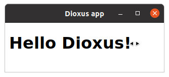

# Props de Componentes

Assim como você pode passar argumentos para uma função, você pode passar _props_ para um componente que personaliza seu comportamento! Os componentes que vimos até agora não aceitam _props_ – então vamos escrever alguns componentes que aceitam.

## `#[derive(Props)]`

_Props_ de componente são uma única estrutura anotada com `#[derive(Props)]`. Para um componente aceitar _props_, o tipo de seu argumento deve ser `Scope<YourPropsStruct>`. Então, você pode acessar o valor das _props_ usando `cx.props`.

Existem 2 tipos de estruturas Props:

- `props` próprios:
  - Não tem uma vida útil associada
  - Implementam `PartialEq`, permitindo a memoização (se os _props_ não mudarem, o Dioxus não renderizará novamente o componente)
- `props` emprestados:
  - [Emprestado](https://doc.rust-lang.org/beta/rust-by-example/scope/borrow.html) de um componente pai
  - Não pode ser memoizado devido a restrições de tempo de vida (Rust's lifetime)

### Props Próprios

_Props_ próprios são muito simples – eles não emprestam nada. Exemplo:

```rust
{{#include ../../../examples/component_owned_props.rs:Likes}}
```

Você pode então passar valores de _prop_ para o componente da mesma forma que você passaria atributos para um elemento:

```rust
{{#include ../../../examples/component_owned_props.rs:App}}
```


### Props Emprestados

Possuir _props_ funciona bem se seus _props_ forem fáceis de copiar – como um único número. Mas e se precisarmos passar um tipo de dados maior, como uma `String` de um componente `App` para um subcomponente `TitleCard`? Uma solução ingênua pode ser [`.clone()`](https://doc.rust-lang.org/std/clone/trait.Clone.html) a `String`, criando uma cópia dela para o subcomponente – mas isso seria ineficiente, especialmente para `Strings` maiores.

Rust permite algo mais eficiente – emprestar a `String` como um `&str` – é para isso que servem as _props emprestadas_!

```rust
{{#include ../../../examples/component_borrowed_props.rs:TitleCard}}
```

Podemos então usar o componente assim:

```rust
{{#include ../../../examples/component_borrowed_props.rs:App}}
```



## Props de Option

A macro `#[derive(Props)]` tem alguns recursos que permitem personalizar o comportamento dos adereços.

### Props Opcionais

Você pode criar campos opcionais usando o tipo `Option<…>` para um campo:

```rust
{{#include ../../../examples/component_props_options.rs:OptionalProps}}
```

Em seguida, você pode optar por fornecê-los ou não:

```rust
{{#include ../../../examples/component_props_options.rs:OptionalProps_usage}}
```

### `Option` Explicitamente Obrigatórias

Se você quiser exigir explicitamente uma `Option`, e não uma _prop_ opcional, você pode anotá-la com `#[props(!optional)]`:

```rust
{{#include ../../../examples/component_props_options.rs:ExplicitOption}}
```

Então, você tem que passar explicitamente `Some("str")` ou `None`:

```rust
{{#include ../../../examples/component_props_options.rs:ExplicitOption_usage}}
```

### Props Padrão

Você pode usar `#[props(default = 42)]` para tornar um campo opcional e especificar seu valor padrão:

```rust
{{#include ../../../examples/component_props_options.rs:DefaultComponent}}
```

Então, da mesma forma que _props_ opcionais, você não precisa fornecê-lo:

```rust
{{#include ../../../examples/component_props_options.rs:DefaultComponent_usage}}
```

### Conversão Automática com `.into`

É comum que as funções Rust aceitem `impl Into<SomeType>` em vez de apenas `SomeType` para suportar uma ampla gama de parâmetros. Se você quiser uma funcionalidade semelhante com _props_, você pode usar `#[props(into)]`. Por exemplo, você pode adicioná-lo em uma prop `String` – e `&str` também será aceito automaticamente, pois pode ser convertido em `String`:

```rust
{{#include ../../../examples/component_props_options.rs:IntoComponent}}
```

Então, você pode usá-lo assim:

```rust
{{#include ../../../examples/component_props_options.rs:IntoComponent_usage}}
```

## A macro `inline_props`

Até agora, todas as funções `Component` que vimos tinham uma _struct_ `ComponentProps` correspondente para passar em _props_. Isso foi bastante verboso... Não seria legal ter _props_ como argumentos de função simples? Então não precisaríamos definir uma estrutura Props, e ao invés de digitar `cx.props.whatever`, poderíamos usar `whatever` diretamente!

`inline_props` permite que você faça exatamente isso. Em vez de digitar a versão "completa":

```rust
#[derive(Props, PartialEq)]
struct TitleCardProps {
    title: String,
}

fn TitleCard(cx: Scope<TitleCardProps>) -> Element {
    cx.render(rsx!{
        h1 { "{cx.props.title}" }
    })
}
```

...você pode definir uma função que aceita _props_ como argumentos. Então, basta anotá-lo com `#[inline_props]`, e a macro irá transformá-lo em um componente regular para você:

```rust
#[inline_props]
fn TitleCard(cx: Scope, title: String) -> Element {
    cx.render(rsx!{
        h1 { "{title}" }
    })
}
```

> Embora o novo Componente seja mais curto e fácil de ler, essa macro não deve ser usada por autores de bibliotecas, pois você tem menos controle sobre a documentação do Prop.
