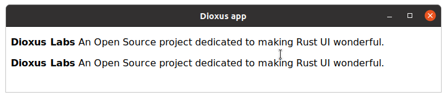

# Componentes

Assim como você não gostaria de escrever um programa complexo em uma única e longa função `main`, você não deve construir uma interface complexa em uma única função `App`. Em vez disso, seria melhor dividir a funcionalidade de um aplicativo em partes lógicas chamadas componentes.

Um componente é uma função Rust, nomeada em _UpperCammelCase_, que recebe um parâmetro `Scope` e retorna um `Element` descrevendo a interface do usuário que deseja renderizar. Na verdade, nossa função `App` é um componente!

```rust
{{#include ../../examples/hello_world_desktop.rs:component}}
```

> Você provavelmente desejará adicionar `#![allow(non_snake_case)]` no topo de sua caixa para evitar avisos sobre o nome da função

Um Componente é responsável por alguma tarefa de renderização – normalmente, renderizando uma parte isolada da interface do usuário. Por exemplo, você pode ter um componente `About` que renderiza uma breve descrição do Dioxus Labs:

```rust
{{#include ../../examples/components.rs:About}}
```

Em seguida, você pode renderizar seu componente em outro componente, da mesma forma que os elementos são renderizados:

```rust
{{#include ../../examples/components.rs:App}}
```



> Neste ponto, pode parecer que os componentes nada mais são do que funções. No entanto, à medida que você aprende mais sobre os recursos do Dioxus, verá que eles são realmente mais poderosos!
