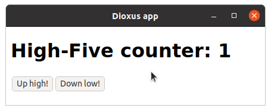

# Hooks e Estado do Componente

Até agora nossos componentes, sendo funções Rust, não tinham estado – eles estavam sempre renderizando a mesma coisa. No entanto, em um componente de interface do usuário, geralmente é útil ter uma funcionalidade com estado para criar interações do usuário. Por exemplo, você pode querer rastrear se o usuário abriu uma lista suspensa e renderizar coisas diferentes de acordo.

Para lógica com estado, você pode usar _hooks_. _Hooks_ são funções Rust que fazem referência a `ScopeState` (em um componente, você pode passar `&cx`), e fornecem funcionalidade e estado.

## Hook `use_state`

[`use_state`](https://docs.rs/dioxus/latest/dioxus/hooks/fn.use_state.html) é um dos _hooks_ mais simples.

- Você fornece um fechamento que determina o valor inicial
- `use_state` fornece o valor atual e uma maneira de atualizá-lo, definindo-o para outra coisa
- Quando o valor é atualizado, `use_state` faz o componente renderizar novamente e fornece o novo valor

Por exemplo, você pode ter visto o exemplo do contador, no qual o estado (um número) é rastreado usando o _hook_ `use_state`:

```rust
{{#include ../../examples/hooks_counter.rs:component}}
```



Toda vez que o estado do componente muda, ele é renderizado novamente e a função do componente é chamada, para que você possa descrever como deseja que a nova interface do usuário se pareça. Você não precisa se preocupar em "mudar" nada - apenas descreva o que você quer em termos de estado, e Dioxus cuidará do resto!

> `use_state` retorna seu valor envolto em uma _smart pointer_ do tipo [`UseState`](https://docs.rs/dioxus/latest/dioxus/hooks/struct.UseState.html). É por isso que você pode ler o valor e atualizá-lo, mesmo dentro de um manipulador.

Você pode usar vários _hooks_ no mesmo componente se quiser:

```rust
{{#include ../../examples/hooks_counter_two_state.rs:component}}
```


## Regras dos Hooks

O exemplo acima pode parecer um pouco mágico, já que as funções Rust normalmente não estão associadas ao estado. O Dioxus permite que os _hooks_ mantenham o estado entre as renderizações através de uma referência a `ScopeState`, e é por isso que você deve passar `&cx` para eles.

Mas como Dioxus pode diferenciar entre vários _hooks_ no mesmo componente? Como você viu no segundo exemplo, ambas as funções `use_state` foram chamadas com os mesmos parâmetros, então como elas podem retornar coisas diferentes quando os contadores são diferentes?

```rust
{{#include ../../examples/hooks_counter_two_state.rs:use_state_calls}}
```

Isso só é possível porque os dois _hooks_ são sempre chamados na mesma ordem, então Dioxus sabe qual é qual. Portanto, a ordem em que você chama os _hooks_ é importante, e é por isso que você deve seguir certas regras ao usar os _hooks_:

1. _Hooks_ só podem ser usados em componentes ou outros _hooks_ (falaremos disso mais tarde)
2. Em cada chamada para a função componente
   1. Os mesmos _hooks_ devem ser chamados
   2. Na mesma ordem
3. Os nomes dos _hooks_ devem começar com `use_` para que você não os confunda acidentalmente com funções normais

Essas regras significam que há certas coisas que você não pode fazer com _hooks_:

### Sem Hooks em Condicionais

```rust
{{#include ../../examples/hooks_bad.rs:conditional}}
```

### Sem Hooks em Closures

```rust
{{#include ../../examples/hooks_bad.rs:closure}}
```

### Sem Hooks em Loops

```rust
{{#include ../../examples/hooks_bad.rs:loop}}
```

## Gancho `use_ref`

`use_state` é ótimo para rastrear valores simples. No entanto, você pode notar na [`UseState` API](https://docs.rs/dioxus/latest/dioxus/hooks/struct.UseState.html) que a única maneira de modificar seu valor é substituí-lo por algo else (por exemplo, chamando `set`, ou através de um dos operadores `+=`, `-=`). Isso funciona bem quando é barato construir um valor (como qualquer primitivo). Mas e se você quiser manter dados mais complexos no estado dos componentes?

Por exemplo, suponha que queremos manter um `Vec` de valores. Se o armazenamos com `use_state`, a única maneira de adicionar um novo valor à lista seria criar um novo `Vec` com o valor adicional e colocá-lo no estado. Isto é custoso! Queremos modificar o `Vec` existente.

Felizmente, existe outro _hook_ para isso, `use_ref`! É semelhante ao `use_state`, mas permite obter uma referência mutável aos dados contidos.

Aqui está um exemplo simples que mantém uma lista de eventos em um `use_ref`. Podemos adquirir acesso de escrita ao estado com `.write()`, e então apenas `.push` um novo valor para o estado:

```rust
{{#include ../../examples/hooks_use_ref.rs:component}}
```

> Os valores de retorno de `use_state` e `use_ref`, (`UseState` e `UseRef`, respectivamente) são de alguma forma semelhantes a [`Cell`](https://doc.rust-lang.org/std/ cell/) e [`RefCell`](https://doc.rust-lang.org/std/cell/struct.RefCell.html) – eles fornecem mutabilidade interior. No entanto, esses _wrappers_ do Dioxus também garantem que o componente seja renderizado novamente sempre que você alterar o estado.
