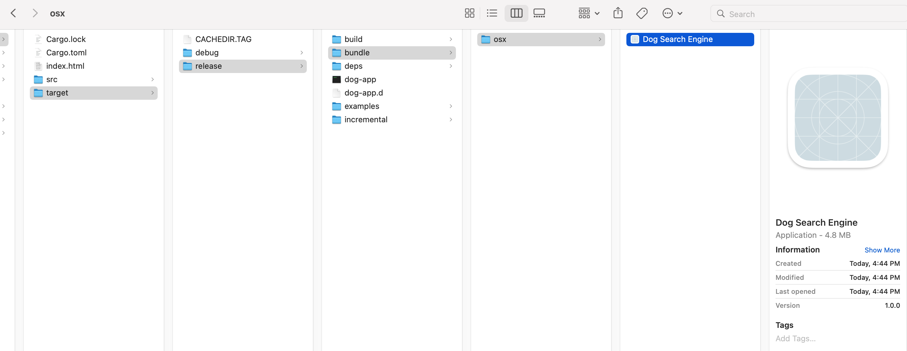

# Publicação

Parabéns! Você fez seu primeiro aplicativo Dioxus que realmente faz coisas muito legais. Este aplicativo usa a biblioteca WebView do seu sistema operacional, portanto, é portátil para ser distribuído para outras plataformas.

Nesta seção, abordaremos como agrupar seu aplicativo para macOS, Windows e Linux.

## Instale o `cargo-bundle`

A primeira coisa que faremos é instalar o [`cargo-bundle`](https://github.com/burtonageo/cargo-bundle). Essa extensão para carga facilitará muito o empacotamento do nosso aplicativo para as várias plataformas.

De acordo com a página do github `cargo-bundle`,

_"cargo-bundle é uma ferramenta usada para gerar instaladores ou pacotes de aplicativos para executáveis ​​GUI criados com o cargo. Ele pode criar pacotes .app para Mac OS X e iOS, pacotes .deb para Linux e instaladores .msi para Windows (observe no entanto que o suporte para iOS e Windows ainda é experimental). O suporte para a criação de pacotes .rpm (para Linux) e pacotes .apk (para Android) ainda está pendente."_

Para instalar, basta executar

`cargo install <name of cargo package>`

## Configurando seu Projeto

Para obter uma configuração de projeto para empacotamento, precisamos adicionar algumas _flags_ ao nosso arquivo `Cargo.toml`.

```toml
[package]
name = "example"
# ...other fields...

[package.metadata.bundle]
name = "DogSearch"
identifier = "com.dogs.dogsearch"
version = "1.0.0"
copyright = "Copyright (c) Jane Doe 2016. All rights reserved."
category = "Developer Tool"
short_description = "Easily search for Dog photos"
long_description = """
This app makes it quick and easy to browse photos of dogs from over 200 bree
"""
```

## Empacotando

Seguindo as instruções do cargo-bundle, simplesmente `cargo-bundle --release` para produzir um aplicativo final com todas as otimizações e recursos integrados.

Depois de executar `cargo-bundle --release`, seu aplicativo deve estar acessível em

`target/release/bundle/<platform>/`.

Por exemplo, um aplicativo macOS ficaria assim:



Ótimo! E são apenas 4,8 Mb – extremamente enxutos! Como o Dioxus aproveita o WebView nativo da sua plataforma, os aplicativos Dioxus são extremamente eficientes em termos de memória e não desperdiçam sua bateria.

> Nota: nem todo CSS funciona da mesma forma em todas as plataformas. Certifique-se de visualizar o CSS do seu aplicativo em cada plataforma – ou navegador da web (Firefox, Chrome, Safari) antes de publicar.
