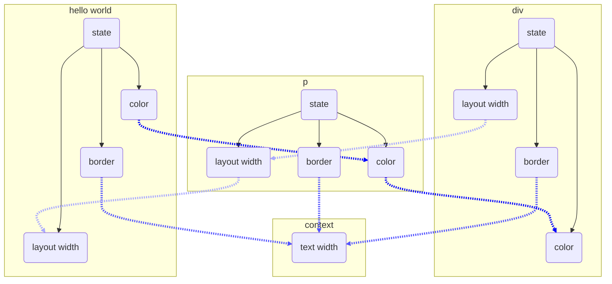

# Renderizador Personalizado

Dioxus é uma estrutura incrivelmente portátil para desenvolvimento de interface do usuário. As lições, conhecimentos, hooks e componentes que você adquire ao longo do tempo sempre podem ser aproveitados ​​para projetos futuros. No entanto, às vezes, esses projetos não podem aproveitar um renderizador compatível ou você precisa implementar seu próprio renderizador melhor.

Ótimas notícias: o design do renderizador depende inteiramente de você! Nós fornecemos sugestões e inspiração com os renderizadores originais, mas só realmente precisamos processar `DomEdits` e enviar `UserEvents`.

## Em Detalhes:

A implementação do renderizador é bastante simples. O renderizador precisa:

1. Lidar com o fluxo de edições gerado por atualizações no DOM virtual
2. Registrar ouvintes e passe eventos para o sistema de eventos do DOM virtual

Essencialmente, seu renderizador precisa implementar o traço `RealDom` e gerar objetos `EventTrigger` para atualizar o `VirtualDOM`. A partir daí, você terá tudo o que precisa para renderizar o `VirtualDOM` na tela.

Internamente, o Dioxus lida com o relacionamento da árvore, `diffing`, gerenciamento de memória e o sistema de eventos, deixando o mínimo necessário para que os renderizadores se implementem.

Para referência, confira o interpretador JavaScript ou o renderizador TUI como ponto de partida para seu renderizador personalizado.

## DomEdições

O tipo "DomEdit" é uma enumeração serializada que representa uma operação atômica que ocorre no `RealDom`. As variantes seguem aproximadamente este conjunto:

```rust
enum DomEdit {
    PushRoot,
    AppendChildren,
    ReplaceWith,
    InsertAfter,
    InsertBefore,
    Remove,
    CreateTextNode,
    CreateElement,
    CreateElementNs,
    CreatePlaceholder,
    NewEventListener,
    RemoveEventListener,
    SetText,
    SetAttribute,
    RemoveAttribute,
    PopRoot,
}
```

O mecanismo de diferenciação do Dioxus opera como uma [máquina de pilha] (https://en.wikipedia.org/wiki/Stack_machine) onde o método `push_root` empilhar um novo nó DOM "real" para a pilha e `append_child` e `replace_with` ambos removem nós da pilha.

### Um exemplo

Por uma questão de compreensão, vamos considerar este exemplo - uma declaração de interface do usuário muito simples:

```rust
rsx!( h1 {"hello world"} )
```

To get things started, Dioxus must first navigate to the container of this h1 tag. To "navigate" here, the internal diffing algorithm generates the DomEdit `PushRoot` where the ID of the root is the container.

When the renderer receives this instruction, it pushes the actual Node onto its own stack. The real renderer's stack will look like this:

```rust
instructions: [
    PushRoot(Container)
]
stack: [
    ContainerNode,
]
```

Em seguida, o Dioxus encontrará o nó `h1`. O algoritmo `diff` decide que este nó precisa ser criado, então o Dioxus irá gerar o DomEdit `CreateElement`. Quando o renderizador receber esta instrução, ele criará um nó desmontado e o enviará para sua própria pilha:

```rust
instructions: [
    PushRoot(Container),
    CreateElement(h1),
]
stack: [
    ContainerNode,
    h1,
]
```

Em seguida, Dioxus vê o nó de texto e gera o DomEdit `CreateTextNode`:

```rust
instructions: [
    PushRoot(Container),
    CreateElement(h1),
    CreateTextNode("hello world")
]
stack: [
    ContainerNode,
    h1,
    "hello world"
]
```

Lembre-se, o nó de texto não está anexado a nada (ele está desmontado), então o Dioxus precisa gerar um `Edit` que conecte o nó de texto ao elemento `h1`. Depende da situação, mas neste caso usamos `AppendChildren`. Isso remove o nó de texto da pilha, deixando o elemento `h1` como o próximo elemento na linha.

```rust
instructions: [
    PushRoot(Container),
    CreateElement(h1),
    CreateTextNode("hello world"),
    AppendChildren(1)
]
stack: [
    ContainerNode,
    h1
]
```

Chamamos `AppendChildren` novamente, retirando o nó `h1` e anexando-o ao pai:

```rust
instructions: [
    PushRoot(Container),
    CreateElement(h1),
    CreateTextNode("hello world"),
    AppendChildren(1),
    AppendChildren(1)
]
stack: [
    ContainerNode,
]
```

Finalmente, o contêiner é aberto, pois não precisamos mais dele.

```rust
instructions: [
    PushRoot(Container),
    CreateElement(h1),
    CreateTextNode("hello world"),
    AppendChildren(1),
    AppendChildren(1),
    PopRoot
]
stack: []
```

Com o tempo, nossa pilha ficou assim:

```rust
[]
[Container]
[Container, h1]
[Container, h1, "hello world"]
[Container, h1]
[Container]
[]
```

Observe como nossa pilha fica vazia depois que a interface do usuário é montada. Convenientemente, essa abordagem separa completamente o `VirtualDOM` e o `RealDOM`. Além disso, essas edições são serializáveis, o que significa que podemos até gerenciar UIs em uma conexão de rede. Esta pequena máquina de pilha e edições serializadas tornam o Dioxus independente das especificidades da plataforma.

Dioxus também é muito rápido. Como o Dioxus divide a fase de `diff` e `patch`, ele é capaz de fazer todas as edições no `RealDOM` em um período de tempo muito curto (menos de um único quadro), tornando a renderização muito rápida. Ele também permite que o Dioxus cancele grandes operações de diferenciação se ocorrer um trabalho de prioridade mais alta durante a diferenciação.

É importante notar que há uma camada de conexão entre o Dioxus e o renderizador. O Dioxus salva e carrega elementos (a edição `PushRoot`) com um ID. Dentro do `VirtualDOM`, isso é rastreado apenas como um `u64`.

Sempre que uma edição `CreateElement` é gerada durante a comparação, o Dioxus incrementa seu contador de nós e atribui a esse novo elemento seu `NodeCount` atual. O `RealDom` é responsável por lembrar este ID e enviar o nó correto quando `PushRoot(ID)` é gerado. Dioxus recupera os IDs de elementos quando removidos. Para ficar em sincronia com Dioxus, você pode usar um `Sparce Vec` (`Vec<Option<T>>`) com itens possivelmente desocupados. Você pode usar os ids como índices no `Vec` para elementos e aumentar o `Vec` quando um id não existir.

Esta pequena demonstração serve para mostrar exatamente como um renderizador precisaria processar um stream de edição para construir UIs. Um conjunto de DOMEdits serializados para várias demos está disponível para você testar seu renderizador personalizado.

## Ciclo de eventos

Como a maioria das GUIs, o Dioxus conta com um `loop` de eventos para progredir no `VirtualDOM`. O próprio `VirtualDOM` também pode produzir eventos, por isso é importante que seu renderizador personalizado também possa lidar com eles.

O código para a implementação do `WebSys` é direto, então vamos adicioná-lo aqui para demonstrar como um `loop` de eventos é simples:

```rust
pub async fn run(&mut self) -> dioxus_core::error::Result<()> {
    // Push the body element onto the WebsysDom's stack machine
    let mut websys_dom = crate::new::WebsysDom::new(prepare_websys_dom());
    websys_dom.stack.push(root_node);

    // Rebuild or hydrate the virtualdom
    let mutations = self.internal_dom.rebuild();
    websys_dom.apply_mutations(mutations);

    // Wait for updates from the real dom and progress the virtual dom
    loop {
        let user_input_future = websys_dom.wait_for_event();
        let internal_event_future = self.internal_dom.wait_for_work();

        match select(user_input_future, internal_event_future).await {
            Either::Left((_, _)) => {
                let mutations = self.internal_dom.work_with_deadline(|| false);
                websys_dom.apply_mutations(mutations);
            },
            Either::Right((event, _)) => websys_dom.handle_event(event),
        }

        // render
    }
}
```

É importante que você decodifique os eventos reais do seu sistema de eventos no sistema de eventos sintético do Dioxus (significado sintético abstraído). Isso significa simplesmente combinar seu tipo de evento e criar um tipo Dioxus `UserEvent`. No momento, o sistema `VirtualEvent` é modelado quase inteiramente em torno da especificação HTML, mas estamos interessados em reduzi-lo.

```rust
fn virtual_event_from_websys_event(event: &web_sys::Event) -> VirtualEvent {
    match event.type_().as_str() {
        "keydown" => {
            let event: web_sys::KeyboardEvent = event.clone().dyn_into().unwrap();
            UserEvent::KeyboardEvent(UserEvent {
                scope_id: None,
                priority: EventPriority::Medium,
                name: "keydown",
                // This should be whatever element is focused
                element: Some(ElementId(0)),
                data: Arc::new(KeyboardData{
                    char_code: event.char_code(),
                    key: event.key(),
                    key_code: event.key_code(),
                    alt_key: event.alt_key(),
                    ctrl_key: event.ctrl_key(),
                    meta_key: event.meta_key(),
                    shift_key: event.shift_key(),
                    locale: "".to_string(),
                    location: event.location(),
                    repeat: event.repeat(),
                    which: event.which(),
                })
            })
        }
        _ => todo!()
    }
}
```

## Elementos brutos personalizados

Se você precisar ir mais longe a ponto de confiar em elementos personalizados para o seu renderizador - você pode. Isso ainda permitiria que você usasse a natureza reativa do Dioxus, sistema de componentes, estado compartilhado e outros recursos, mas acabará gerando nós diferentes. Todos os atributos e ouvintes para o namespace HTML e SVG são transportados por meio de estruturas auxiliares que essencialmente compilam (não representam sobrecarga de tempo de execução). Você pode colocar seus próprios elementos a qualquer hora que quiser, sem problemas. No entanto, você deve ter certeza absoluta de que seu renderizador pode lidar com o novo tipo, ou ele irá "bater e queimar".

Esses elementos personalizados são definidos como `unit struct` com implementações de `traits`.

Por exemplo, o elemento `div` é (aproximadamente!) definido assim:

```rust
struct div;
impl div {
    /// Some glorious documentation about the class property.
    const TAG_NAME: &'static str = "div";
    const NAME_SPACE: Option<&'static str> = None;
    // define the class attribute
    pub fn class<'a>(&self, cx: NodeFactory<'a>, val: Arguments) -> Attribute<'a> {
        cx.attr("class", val, None, false)
    }
    // more attributes
}
```

Você provavelmente notou que muitos elementos nas macros `rsx!` suportam documentação em foco. A abordagem que adotamos para elementos personalizados significa que a estrutura da unidade é criada imediatamente onde o elemento é usado no macro. Quando o macro é expandido, os comentários doc ainda se aplicam à estrutura da unidade, dando toneladas de feedback no editor, mesmo dentro de uma macro procedural.

# Núcleo Nativo

Os renderizadores dão muito trabalho. Se você estiver criando um renderizador em Rust, o núcleo nativo fornece alguns utilitários para implementar um renderizador. Ele fornece uma abstração sobre DomEdits e manipula o layout para você.

## RealDom

O `RealDom` é uma abstração de nível superior sobre a atualização do DOM. Ele é atualizado com `DomEdits` e fornece uma maneira de atualizar lentamente o estado dos nós com base em quais atributos mudam.

### Exemplo

Vamos construir um renderizador de brinquedo com bordas, tamanho e cor do texto.
Antes de começarmos, vamos dar uma olhada em um elemento de exemplo que podemos renderizar:

```rust
cx.render(rsx!{
    div{
        color: "red",
        p{
            border: "1px solid black",
            "hello world"
        }
    }
})
```

Nesta árvore a cor depende da cor do pai. O tamanho depende do tamanho das crianças, do texto atual e do tamanho do texto. A borda depende apenas do nó atual.



Para ajudar na construção de um Dom, o núcleo nativo fornece quatro características: `State`, `ChildDepState`, `ParentDepState` e `NodeDepState` e uma estrutura `RealDom`.

```rust
use dioxus_native_core::node_ref::*;
use dioxus_native_core::state::{ChildDepState, NodeDepState, ParentDepState, State};
use dioxus_native_core_macro::{sorted_str_slice, State};

#[derive(Default, Copy, Clone)]
struct Size(f32, f32);
// Size only depends on the current node and its children, so it implements ChildDepState
impl ChildDepState for Size {
    // Size accepts a font size context
    type Ctx = f32;
    // Size depends on the Size part of each child
    type DepState = Self;
    // Size only cares about the width, height, and text parts of the current node
    const NODE_MASK: NodeMask =
        NodeMask::new_with_attrs(AttributeMask::Static(&sorted_str_slice!(["width", "height"]))).with_text();
    fn reduce<'a>(
        &mut self,
        node: NodeView,
        children: impl Iterator<Item = &'a Self::DepState>,
        ctx: &Self::Ctx,
    ) -> bool
    where
        Self::DepState: 'a,
    {
        let mut width;
        let mut height;
        if let Some(text) = node.text() {
            // if the node has text, use the text to size our object
            width = text.len() as f32 * ctx;
            height = ctx;
        } else {
            // otherwise, the size is the maximum size of the children
            width = *children
                .reduce(|accum, item| if accum >= item.0 { accum } else { item.0 })
                .unwrap_or(0.0));
            height = *children
                .reduce(|accum, item| if accum >= item.1 { accum } else { item.1 })
                .unwrap_or(&0.0);
        }
        // if the node contains a width or height attribute it overrides the other size
        for a in node.attibutes(){
            match a.name{
                "width" => width = a.value.parse().unwrap(),
                "height" => height = a.value.parse().unwrap(),
                // because Size only depends on the width and height, no other attributes will be passed to the member
                _ => panic!()
            }
        }
        // to determine what other parts of the dom need to be updated we return a boolean that marks if this member changed
        let changed = (width != self.0) || (height != self.1);
        *self = Self(width, height);
        changed
    }
}

#[derive(Debug, Clone, Copy, PartialEq, Default)]
struct TextColor {
    r: u8,
    g: u8,
    b: u8,
}
// TextColor only depends on the current node and its parent, so it implements ParentDepState
impl ParentDepState for TextColor {
    type Ctx = ();
    // TextColor depends on the TextColor part of the parent
    type DepState = Self;
    // TextColor only cares about the color attribute of the current node
    const NODE_MASK: NodeMask = NodeMask::new_with_attrs(AttributeMask::Static(&["color"]));
    fn reduce(
        &mut self,
        node: NodeView,
        parent: Option<&Self::DepState>,
        _ctx: &Self::Ctx,
    ) -> bool {
        // TextColor only depends on the color tag, so getting the first tag is equivilent to looking through all tags
        let new = match node.attributes().next() {
            // if there is a color tag, translate it
            Some("red") => TextColor { r: 255, g: 0, b: 0 },
            Some("green") => TextColor { r: 0, g: 255, b: 0 },
            Some("blue") => TextColor { r: 0, g: 0, b: 255 },
            Some(_) => panic!("unknown color"),
            // otherwise check if the node has a parent and inherit that color
            None => match parent {
                Some(parent) => *parent,
                None => Self::default(),
            },
        };
        // check if the member has changed
        let changed = new != *self;
        *self = new;
        changed
    }
}

#[derive(Debug, Clone, PartialEq, Default)]
struct Border(bool);
// TextColor only depends on the current node, so it implements NodeDepState
impl NodeDepState for Border {
    type Ctx = ();
    // Border does not depended on any other member in the current node
    type DepState = ();
    // Border does not depended on any other member in the current node
    const NODE_MASK: NodeMask =
        NodeMask::new_with_attrs(AttributeMask::Static(&["border"]));
    fn reduce(&mut self, node: NodeView, _sibling: &Self::DepState, _ctx: &Self::Ctx) -> bool {
        // check if the node contians a border attribute
        let new = Self(node.attributes().next().map(|a| a.name == "border").is_some());
        // check if the member has changed
        let changed = new != *self;
        *self = new;
        changed
    }
}

// State provides a derive macro, but anotations on the members are needed in the form #[dep_type(dep_member, CtxType)]
#[derive(State, Default, Clone)]
struct ToyState {
    // the color member of it's parent and no context
    #[parent_dep_state(color)]
    color: TextColor,
    // depends on the node, and no context
    #[node_dep_state()]
    border: Border,
    // depends on the layout_width member of children and f32 context (for text size)
    #[child_dep_state(size, f32)]
    size: Size,
}
```

Agora que temos nosso estado, podemos colocá-lo em uso em nosso DOM. Nós podemos atualizar o DOM com `update_state` para atualizar a estrutura do `DOM` (adicionando, removendo e alterando as propriedades dos nós) e então `apply_mutations` para atualizar o `ToyState` para cada um dos nós que foram alterados.

```rust
fn main(){
    fn app(cx: Scope) -> Element {
        cx.render(rsx!{
            div{
                color: "red",
                "hello world"
            }
        })
    }
    let vdom = VirtualDom::new(app);
    let rdom: RealDom<ToyState> = RealDom::new();

    let mutations = dom.rebuild();
    // update the structure of the real_dom tree
    let to_update = rdom.apply_mutations(vec![mutations]);
    let mut ctx = AnyMap::new();
    // set the font size to 3.3
    ctx.insert(3.3);
    // update the ToyState for nodes in the real_dom tree
    let _to_rerender = rdom.update_state(&dom, to_update, ctx).unwrap();

    // we need to run the vdom in a async runtime
    tokio::runtime::Builder::new_current_thread()
        .enable_all()
        .build()?
        .block_on(async {
            loop{
                let wait = vdom.wait_for_work();
                let mutations = vdom.work_with_deadline(|| false);
                let to_update = rdom.apply_mutations(mutations);
                let mut ctx = AnyMap::new();
                ctx.insert(3.3);
                let _to_rerender = rdom.update_state(vdom, to_update, ctx).unwrap();

                // render...
            }
        })
}
```

## Disposição

Para a maioria das plataformas, o layout dos Elementos permanecerá o mesmo. O módulo layout_attributes fornece uma maneira de aplicar atributos `html` a um estilo de layout estendido.

## Conclusão

Pronto, é isso! Você deve ter quase todo o conhecimento necessário sobre como implementar seu próprio renderizador. Estamos super interessados em ver os aplicativos Dioxus trazidos para renderizadores de desktop personalizados, renderizador para dispositivos móveis, interface do usuário para videogames e até realidade aumentada! Se você estiver interessado em contribuir para qualquer um desses projetos, não tenha medo de entrar em contato ou se juntar à comunidade.
