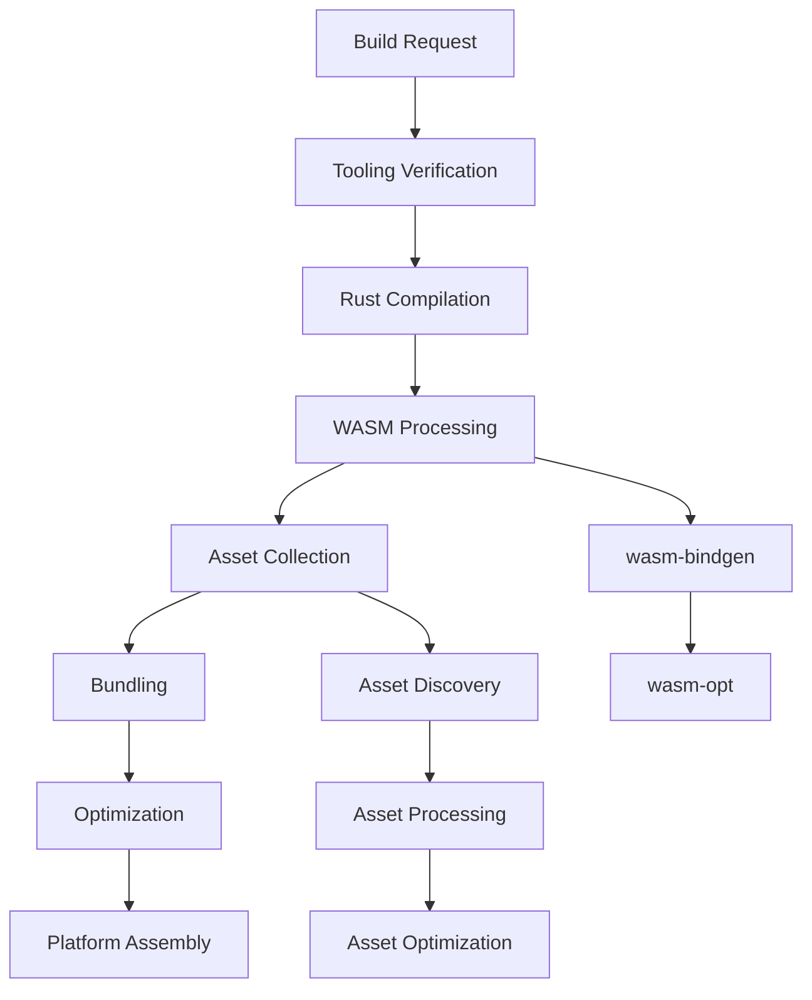

# dx.md - Dioxus CLI Build System Deep Dive

This document provides an in-depth analysis of how the `dx` command line tool works, with a focus on integration points and customization opportunities for WASM processing, instrumentation, and build pipeline modifications.

## Architecture Overview

The dx CLI is built around a multi-stage build pipeline that handles cross-platform compilation, asset processing, and bundling. The architecture is modular and provides several extension points for custom processing.

### Core Components

1. **Build Request System** (`src/build/request.rs`) - Orchestrates the entire build process
2. **Builder Engine** (`src/build/builder.rs`) - Manages build state and progress tracking
3. **Bundle System** (`src/build/bundle.rs`) - Handles platform-specific packaging and optimization
4. **Asset Management** - Processes and optimizes assets through the build pipeline
5. **Platform Adapters** - Web, Desktop, Mobile, and Server-specific build logic

### Build Pipeline Stages



## WASM Processing Pipeline

The WASM processing is handled in several stages, each providing opportunities for customization:

### 1. Rust to WASM Compilation

**Location**: `BuildRequest::build_cargo()` in `src/build/request.rs`

The compilation uses standard `cargo rustc` with the `wasm32-unknown-unknown` target:

```rust
// Key compilation arguments for WASM
cargo_args.extend([
    "--target", "wasm32-unknown-unknown",
    "--profile", profile_name,
    // ... other args
]);
```

**Integration Points**:
- **Custom RUSTFLAGS**: Set via environment variables in `BuildRequest::env_vars()`
- **Custom Cargo Features**: Controlled via `target_features()` method
- **Build Scripts**: Standard Cargo build scripts can be used for pre-compilation processing

### 2. WASM-Bindgen Processing

**Location**: `AppBundle::run_wasm_bindgen()` in `src/build/bundle.rs`

This stage converts the raw WASM into web-compatible JavaScript bindings:

```rust
WasmBindgen::new(&bindgen_version)
    .input_path(&input_path)
    .target("web")
    .debug(keep_debug)
    .demangle(keep_debug)
    .keep_debug(keep_debug)
    .remove_name_section(!keep_debug)
    .remove_producers_section(!keep_debug)
    .out_name(&name)
    .out_dir(&bindgen_outdir)
    .run()
    .await
```

**Integration Points**:
- **Custom wasm-bindgen Version**: Controlled via `krate.wasm_bindgen_version()`
- **Debug Symbol Control**: Via `debug_symbols` build flag
- **Output Customization**: Custom output directories and naming

### 3. WASM Optimization

**Location**: `AppBundle::run_wasm_opt()` in `src/build/bundle.rs`

Uses wasm-opt for size and performance optimizations:

```rust
#[cfg(feature = "optimizations")]
let mut options = match self.build.krate.config.web.wasm_opt.level {
    WasmOptLevel::Z => wasm_opt::OptimizationOptions::new_optimize_for_size_aggressively(),
    WasmOptLevel::S => wasm_opt::OptimizationOptions::new_optimize_for_size(),
    // ... other levels
};
```

**Configuration**: Controlled via `Dioxus.toml`:
```toml
[web.wasm_opt]
level = "z"  # z, s, 0, 1, 2, 3, 4
debug = false
```

## Integration and Customization Points

### 1. Custom Linker Integration

The dx CLI can act as a custom linker to intercept the linking process:

**Location**: `src/cli/link.rs`

```rust
pub enum LinkAction {
    BuildAssetManifest { destination: PathBuf },
    LinkAndroid { linker: PathBuf, extra_flags: Vec<String> },
}
```

**Usage Example**:
```bash
# Set dx as the linker
RUSTFLAGS="-Clinker=$(which dx)" cargo build --target wasm32-unknown-unknown
# dx detects it's being used as a linker via the dx_magic_link_file env var
```

### 2. Asset Processing Pipeline

**Location**: `AppBundle::write_assets()` in `src/build/bundle.rs`

Assets are processed through the manganis system and can be customized:

```rust
// Custom asset processing happens here
for (from, to, options) in assets_to_transfer.iter() {
    let res = process_file_to(options, from, to);
    // Custom processing can be injected here
}
```

**Integration Points**:
- **Custom Asset Options**: Via manganis `AssetOptions`
- **Pre/Post Processing**: Custom scripts can be run via build.rs
- **Asset Discovery**: Custom asset discovery through the `DEEPLINK` environment variable

### 3. Build Script Hooks

The CLI respects standard Cargo build scripts, providing several hook opportunities:

**Environment Variables Available in build.rs**:
- `ASSET_ROOT_ENV`: Base path for assets
- `APP_TITLE_ENV`: Application title
- Custom variables from `BuildRequest::env_vars()`

### 4. Configuration-Based Customization

**Location**: `src/config/dioxus_config.rs`

The `Dioxus.toml` configuration provides extensive customization:

```toml
[application]
# Custom asset directory
asset_dir = "custom_assets"
# Custom output directory  
out_dir = "custom_out"

[web.wasm_opt]
# WASM optimization level
level = "z"
# Debug information retention
debug = false

[web.resource]
# Custom scripts and styles
style = ["custom.css"]
script = ["custom.js"]
```

### 5. Platform-Specific Extensions

Each platform has specific extension points:

**Web Platform** (`src/build/web.rs`):
- Custom HTML templates (place `index.html` in crate root)
- Custom resource injection
- Base path configuration

**Mobile Platform**:
- Android NDK integration
- Custom manifest generation
- Gradle build customization

## Advanced Integration Patterns

### 1. Custom WASM Post-Processing

To add custom WASM processing after wasm-bindgen but before optimization:

```rust
// In a custom build script or tool
impl AppBundle {
    pub async fn custom_wasm_processing(&self) -> Result<()> {
        let wasm_file = self.build.wasm_bindgen_wasm_output_file();
        
        // Your custom WASM processing here
        // - Instrumentation injection
        // - Custom optimization passes  
        // - Security transformations
        // - etc.
        
        Ok(())
    }
}
```

### 2. Asset Pipeline Extensions

Custom asset processing can be injected at multiple points:

```rust
// Custom asset processor
pub fn custom_asset_processor(options: &AssetOptions, from: &Path, to: &Path) -> Result<()> {
    match options {
        AssetOptions::Image(_) => {
            // Custom image optimization
        }
        AssetOptions::Css(_) => {
            // Custom CSS processing (PostCSS, etc.)
        }
        AssetOptions::Js(_) => {
            // Custom JavaScript processing (minification, etc.)
        }
        _ => {
            // Default processing
            std::fs::copy(from, to)?;
        }
    }
    Ok(())
}
```

### 3. Build Event Hooks

The build system emits events that can be captured:

```rust
// Build event listener
impl Builder {
    pub async fn with_custom_hooks(mut self) -> Self {
        // Subscribe to build events
        while let Some(update) = self.rx.next().await {
            match update {
                BuildUpdate::Progress { stage } => {
                    // Handle build progress
                    self.handle_build_stage(&stage).await;
                }
                BuildUpdate::CompilerMessage { message } => {
                    // Handle compiler messages
                    self.handle_compiler_message(&message).await;
                }
                _ => {}
            }
        }
        self
    }
}
```

## Environment Variables and Configuration

### Build-Time Environment Variables

| Variable | Purpose | Example |
|----------|---------|---------|
| `RUSTFLAGS` | Custom Rust compiler flags | `-Clinker=custom-linker` |
| `CARGO_TARGET_DIR` | Custom target directory | `/tmp/custom-target` |
| `dx_magic_link_file` | Linker interception | JSON configuration |
| `DEEPLINK` | Enable deep asset linking | `1` |
| `ASSET_ROOT_ENV` | Asset root path | `/assets/` |
| `APP_TITLE_ENV` | Application title | `My App` |

### Configuration Precedence

1. Command line arguments (`--flag value`)
2. Environment variables
3. `Dioxus.toml` configuration
4. Default values

## Custom Tool Integration Examples

### 1. WebAssembly Instrumentation

```bash
#!/bin/bash
# Custom WASM instrumentation script

# Build with dx
dx build --platform web --release

# Find the WASM file
WASM_FILE=$(find target/dx -name "*.wasm" | head -1)

# Apply custom instrumentation
my-wasm-instrument --input "$WASM_FILE" --output "$WASM_FILE.instrumented"
mv "$WASM_FILE.instrumented" "$WASM_FILE"

# Continue with bundling
dx bundle --platform web
```

### 2. Custom Asset Processing

```rust
// build.rs
use std::process::Command;

fn main() {
    // Run custom asset processing
    Command::new("my-asset-processor")
        .arg("--input")
        .arg("src/assets")
        .arg("--output")
        .arg("target/processed-assets")
        .status()
        .expect("Failed to run custom asset processor");
        
    println!("cargo:rustc-env=PROCESSED_ASSETS_DIR=target/processed-assets");
}
```

### 3. Integration with External Build Systems

```yaml
# GitHub Actions integration
name: Build with Custom Processing
on: [push]

jobs:
  build:
    steps:
      - uses: actions/checkout@v2
      - name: Install Rust
        uses: actions-rs/toolchain@v1
        with:
          toolchain: stable
          target: wasm32-unknown-unknown
      
      - name: Install dx
        run: cargo install --git https://github.com/DioxusLabs/dioxus dioxus-cli
      
      - name: Custom pre-processing  
        run: ./scripts/preprocess.sh
        
      - name: Build with dx
        run: dx build --platform web --release
        
      - name: Custom post-processing
        run: ./scripts/postprocess.sh
        
      - name: Bundle
        run: dx bundle --platform web
```

## Debugging and Introspection

### Build Pipeline Debugging

```bash
# Enable verbose output
dx build --verbose

# Enable tracing
dx build --trace

# JSON output for tooling
dx build --json-output
```

### Asset Discovery Debugging

```bash
# Enable deep linking for asset debugging
DEEPLINK=1 dx build --platform web
```

### WASM Analysis

```bash
# Analyze WASM output
wasm-objdump -h target/dx/web/public/assets/*.wasm
wasm-objdump -s target/dx/web/public/assets/*.wasm

# Size analysis
wasm-opt --print-stack-ir target/dx/web/public/assets/*.wasm
```

## Performance Considerations

### Build Performance

- **Incremental Builds**: dx supports incremental compilation through Cargo
- **Parallel Processing**: Assets are processed in parallel using rayon
- **Caching**: Build artifacts are cached between runs
- **Profile Optimization**: Different profiles for dev/release builds

### WASM Size Optimization

1. **Optimization Levels**: Configure via `web.wasm_opt.level`
2. **Debug Symbol Stripping**: Control via `debug_symbols` flag  
3. **Dead Code Elimination**: Automatic through wasm-opt
4. **Custom Optimization Passes**: Via custom wasm-opt configuration

## Security Considerations

When integrating custom tools into the build pipeline, consider:

1. **Input Validation**: Validate all external inputs
2. **Sandboxing**: Run custom tools in isolated environments
3. **Dependency Verification**: Verify the integrity of external tools
4. **Output Validation**: Validate generated artifacts
5. **Secrets Management**: Never expose secrets in build logs

## Conclusion

The dx CLI provides a robust and extensible build system with multiple integration points for custom WASM processing, asset handling, and build pipeline modifications. The key extension points include:

- **Linker Interception**: For deep build process integration
- **Asset Processing Pipeline**: For custom asset transformations  
- **Build Script Hooks**: For pre/post-processing steps
- **Configuration System**: For declarative customization
- **Environment Variables**: For runtime behavior modification

By leveraging these integration points, developers can create sophisticated build workflows while maintaining compatibility with the dx ecosystem.
