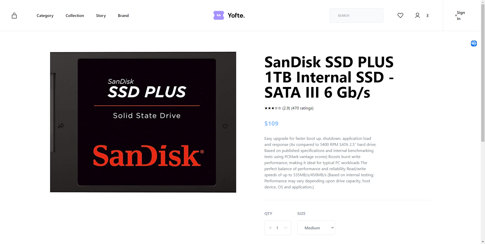

# Dioxus Example: An e-commerce site using the FakeStoreAPI

This example app is a fullstack web application leveraging the [FakeStoreAPI](https://fakestoreapi.com) and [Tailwind CSS](https://tailwindcss.com/).



# Development

1. Run the following commands to serve the application (see the tailwind example in the main Dioxus repo for more detailed information about setting up tailwind):

```bash
npx tailwindcss -i ./input.css -o ./public/tailwind.css --watch
dx serve
```

# Status

This is a work in progress. The following features are currently implemented:

- [x] A homepage with a list of products dynamically fetched from the FakeStoreAPI (rendered using SSR)
- [x] A product detail page with details about a product (rendered using LiveView)
- [ ] A cart page
- [ ] A checkout page
- [ ] A login page
