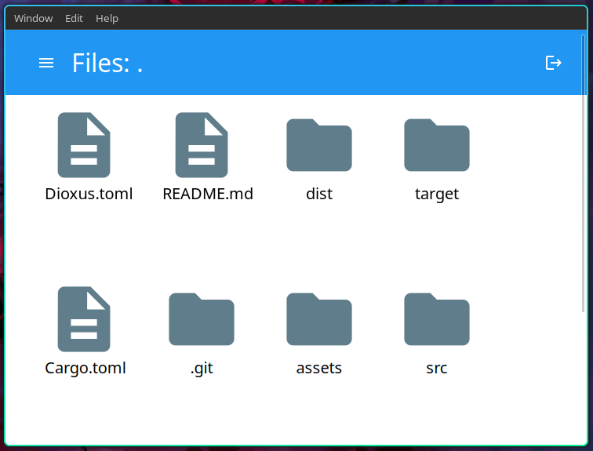

# File-explorer with Rust and Dioxus

This example shows how a Dioxus App can directly leverage system calls and libraries to bridge native functionality with the WebView renderer.




## To run this example:

```
dx serve
```

