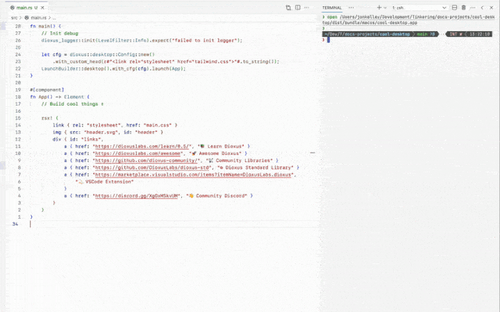

<p>
    <p align="center" >
      <!-- 
       -->
      <!-- <a href="https://dioxuslabs.com">
          
      </a> -->
      
      
      <!--  -->
      <br>
    </p>
</p>
<div align="center">
  <!-- Crates version -->
  <a href="https://crates.io/crates/dioxus">
    
  </a>
  <!-- Downloads -->
  <a href="https://crates.io/crates/dioxus">
    
  </a>
  <!-- docs -->
  <a href="https://docs.rs/dioxus">
    
  </a>
  <!-- CI -->
  <a href="https://github.com/jkelleyrtp/dioxus/actions">
    
  </a>

  <!--Awesome -->
  <a href="https://dioxuslabs.com/awesome">
    
  </a>
  <!-- Discord -->
  <a href="https://discord.gg/XgGxMSkvUM">
    
  </a>
</div>

<div align="center">
  <h3>
    <a href="https://dioxuslabs.com"> 官网 </a>
    <span> | </span>
    <a href="https://github.com/DioxusLabs/dioxus/tree/main/examples"> 示例 </a>
    <span> | </span>
    <a href="https://dioxuslabs.com/learn/0.7/tutorial"> 教程 </a>
    <span> | </span>
    <a href="https://github.com/DioxusLabs/dioxus/blob/main/notes/translations/zh-cn/README.md"> 中文 </a>
    <span> | </span>
    <a href="https://github.com/DioxusLabs/dioxus/blob/main/notes/translations/pt-br/README.md"> PT-BR </a>
    <span> | </span>
    <a href="https://github.com/DioxusLabs/dioxus/blob/main/notes/translations/ja-jp/README.md"> 日本語 </a>
    <span> | </span>
    <a href="https://github.com/DioxusLabs/dioxus/blob/main/notes/translations/tr-tr"> Türkçe </a>
    <span> | </span>
    <a href="https://github.com/DioxusLabs/dioxus/blob/main/notes/translations/ko-kr"> 한국어 </a>
  </h3>
</div>
<br>
<!-- <p align="center">
  <a href="https://github.com/DioxusLabs/dioxus/releases/tag/v0.7.0">✨ Dioxus 0.7 已发布！！！ ✨</a>
</p> -->
<br>

使用单一代码库构建 Web、桌面端、移动端等更多平台的应用。零配置启动、集成热重载，以及基于信号 (Signals) 的状态管理。你可以通过服务器函数添加后端功能，并使用我们的 CLI 进行打包。

```rust
fn app() -> Element {
    let mut count = use_signal(|| 0);

    rsx! {
        h1 { "High-Five counter: {count}" }
        button { onclick: move |_| count += 1, "Up high!" }
        button { onclick: move |_| count -= 1, "Down low!" }
    }
}
```

## ⭐️ 独特功能

- 三行代码即可构建跨平台应用（Web、桌面端、移动端、服务器等）
- [符合人体工程学的状态管理](https://dioxuslabs.com/blog/release-050)，结合了 React、Solid 和 Svelte 的优点
- 内置功能丰富、类型安全的全栈 Web 框架
- 集成面向 Web、macOS、Linux 和 Windows 的打包工具
- Subsecond Rust 热补丁和资源热重载
- 还有更多！ [开启 Dioxus 之旅](https://dioxuslabs.com/learn/0.7/)。

## 即时热重载

只需一个命令 `dx serve`，你的应用即可运行。编辑标记（markup）和样式，几毫秒内就能看到变化。还可以试用实验性的 `dx serve --hotpatch`，实时更新 Rust 代码。

<div align="center">
  
  <!-- <video src="https://private-user-images.githubusercontent.com/10237910/386919031-6da371d5-3340-46da-84ff-628216851ba6.mov" width="500"></video> -->
  <!-- <video src="https://private-user-images.githubusercontent.com/10237910/386919031-6da371d5-3340-46da-84ff-628216851ba6.mov" width="500"></video> -->
</div>

## 构建漂亮的应用

Dioxus 应用使用 HTML 和 CSS 进行样式设计。你可以使用内置的 Tailwind CSS 支持，也可以加载自己喜欢的 CSS 库。还可以轻松调用原生代码（Objective-C、JNI、Web-Sys），从而实现完美的原生体验。

<div align="center">
  
</div>

## 真正的全栈应用

Dioxus 与 [axum](https://github.com/tokio-rs/axum) 深度集成，为客户端和服务器提供强大的全栈能力。你可以使用内置的 WebSocket、SSE、流式传输、文件上传/下载、服务器端渲染、表单、中间件和热重载等能力，也可以完全自定义并集成你现有的 axum 后端。

<div align="center">
  
</div>

## 实验性的原生渲染器

可以使用 web-sys、WebView、服务器端渲染、LiveView，甚至实验性的基于 WGPU 的渲染器来渲染应用。Dioxus 也可以嵌入 Bevy、WGPU，甚至在嵌入式 Linux 上运行！

<div align="center">
  
</div>

## 第一方基础组件

使用一整套以 shadcn/ui 和 Radix Primitives 为模型的基础组件，快速开始构建应用。

<div align="center">
  
</div>

## 一流的 Android 和 iOS 支持

Dioxus 是使用 Rust 构建原生移动应用的最快方式。只需运行 `dx serve --platform android`，你的应用就能在几秒钟内运行在模拟器或实机设备上，并能直接调用 JNI 和原生 API。

<div align="center">
  
</div>

## 为 Web、桌面端和移动端打包

只需运行 `dx bundle`，即可构建并打包你的应用，并进行最大化优化。在 Web 端，可以利用 [`.avif` 生成、`.wasm` 压缩、代码最小化](https://dioxuslabs.com/learn/0.7/tutorial/assets)等功能，构建[体积小于 50kb](https://github.com/ealmloff/tiny-dioxus/) 的 Web 应用，以及小于 5MB 的桌面端/移动端应用。

<div align="center">
  
</div>

## 出色的文档

我们投入了大量精力来构建清晰、易读且全面的文档。所有 HTML 元素和监听器都附有 MDN 文档，并且我们的文档网站与 Dioxus 本身进行持续集成，以确保文档始终保持最新。请查看 [Dioxus 网站](https://dioxuslabs.com/learn/0.7/) 获取指南、参考、示例代码等。有趣的是：我们使用 Dioxus 网站来测试 Dioxus 的新功能 - [快来看看吧！](https://github.com/dioxusLabs/docsite)

<div align="center">
  
</div>

## 社区

Dioxus 是一个社区驱动的项目，拥有非常活跃的 [Discord](https://discord.gg/XgGxMSkvUM) 和 [GitHub](https://github.com/DioxusLabs/dioxus/issues) 社区。我们一直在寻求帮助，乐于回答问题并帮助你入门。[我们的 SDK](https://github.com/DioxusLabs/dioxus-std) 由社区运营，我们甚至有一个 [GitHub 组织](https://github.com/dioxus-community/) 用于那些可以获得免费升级和支持的优秀 Dioxus crates。

<div align="center">
  
</div>

## 全职核心团队

Dioxus 已经从一个业余项目发展成为一个由全职工程师组成的小团队。感谢 FutureWei、Satellite.im 和 GitHub Accelerator 项目的慷慨支持，我们能够全职投入 Dioxus 的开发。我们的长期目标是通过提供高质量的付费企业级工具，让 Dioxus 能够自我维持。如果您的公司有兴趣采用 Dioxus，并希望与我们合作，请联系我们！

## 支持的平台

<div align="center">
  <table style="width:100%">
    <tr>
      <td>
      <b>Web</b>
      </td>
      <td>
        <ul>
          <li>使用 WebAssembly 直接渲染到 DOM</li>
          <li>通过 SSR 进行预渲染并在客户端进行水合 (rehydrate)</li>
          <li>简单的 "hello world" 约 50kb，与 React 相当</li>
          <li>内置开发服务器和热重载，支持快速迭代</li>
        </ul>
      </td>
    </tr>
    <tr>
      <td>
      <b>桌面端</b>
      </td>
      <td>
        <ul>
          <li>使用 WebView 渲染，或实验性地使用 WGPU 或 <a href="https://freyaui.dev">Freya</a> (Skia) 渲染</li>
          <li>零配置启动，只需 `cargo run` 或 `dx serve` 即可构建你的应用</li>
          <li>完全支持原生系统访问，无需 IPC</li>
          <li>支持 macOS、Linux 和 Windows。可生成小于 3MB 的便携式二进制文件</li>
        </ul>
      </td>
    </tr>
    <tr>
      <td>
      <b>移动端</b>
      </td>
      <td>
        <ul>
          <li>使用 WebView 渲染，或实验性地使用 WGPU 或 Skia 渲染</li>
          <li>为 iOS 和 Android 构建 .ipa 和 .apk 文件</li>
          <li>以极低开销直接调用 Java 和 Objective-C</li>
          <li>从 "hello world" 到在设备上运行只需几秒钟</li>
        </ul>
      </td>
    </tr>
    <tr>
      <td>
      <b>服务器端渲染</b>
      </td>
      <td>
        <ul>
          <li>Suspense，水合 (hydration) 和服务器端渲染</li>
          <li>通过服务器函数快速添加后端功能</li>
          <li>集成提取器（extractor）、中间件（middleware）和路由</li>
          <li>静态站点生成和增量生成</li>
        </ul>
      </td>
    </tr>
  </table>
</div>

## 运行示例

> 本仓库 main 分支中的示例针对的是 Dioxus 的 git 版本和 CLI。如果你正在寻找适用于 Dioxus 最新稳定版本的示例，请查看 [0.6 分支](https://github.com/DioxusLabs/dioxus/tree/v0.6/examples)。

本仓库顶层目录中的示例可以通过以下命令运行：

```sh
cargo run --example <example>
```

不过，我们建议你下载 dioxus-cli 来体验热重载等功能。可以使用安装脚本安装最新的二进制 CLI：

```sh
curl -fsSL https://dioxuslabs.com/install.sh | bash
```

如果这个 CLI 版本过旧，你也可以直接从 git 或 cargo-binstall 安装：

```sh
cargo install --git https://github.com/DioxusLabs/dioxus dioxus-cli --locked
```

使用 CLI 时，你可以在 Web 平台上运行示例。你需要通过以下命令禁用默认的 desktop feature，并启用 web feature：

```sh
dx serve --example <example> --platform web -- --no-default-features
```

## 贡献

- 查看网站上[关于贡献的部分](https://dioxuslabs.com/learn/0.7/beyond/contributing)。
- 在我们的 [issue tracker](https://github.com/dioxuslabs/dioxus/issues) 上报告问题。
- [加入](https://discord.gg/XgGxMSkvUM) Discord 并提问！

<a href="https://github.com/dioxuslabs/dioxus/graphs/contributors">
  
</a>

## 开源许可

此项目基于 [MIT license] 或 [Apache-2 License] 发布。

[apache-2 license]: https://github.com/DioxusLabs/dioxus/blob/master/LICENSE-APACHE
[mit license]: https://github.com/DioxusLabs/dioxus/blob/master/LICENSE-MIT

除非您明确声明，否则您有意提交给 Dioxus 的任何贡献，均应按 MIT 或 Apache-2 授权，不附带任何附加条款或条件。
