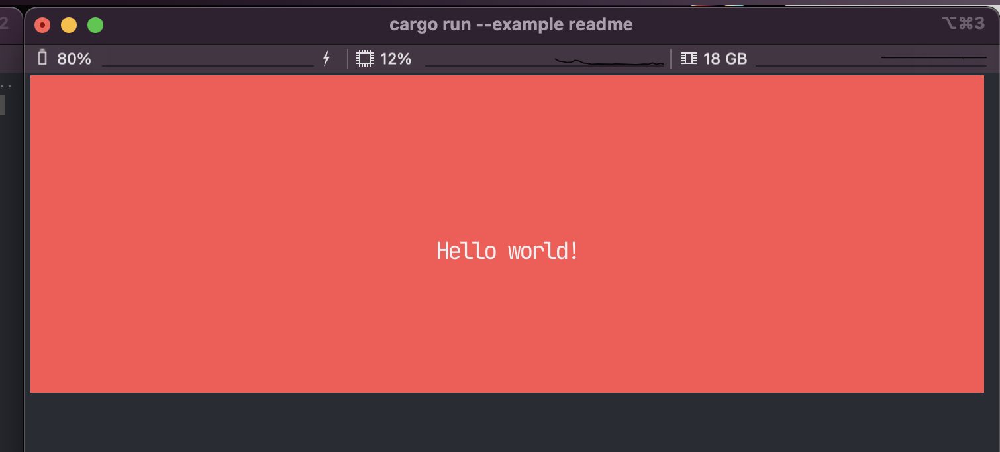

<div align="center">
  <h1>Dioxus TUI</h1>
  <p>
    <strong>Beautiful terminal user interfaces in Rust with <a href="https://dioxuslabs.com/">Dioxus </a>.</strong>
  </p>
</div>

<div align="center">
  <!-- Crates version -->
  <a href="https://crates.io/crates/dioxus">
    
  </a>
  <!-- Downloads -->
  <a href="https://crates.io/crates/dioxus">
    
  </a>
  <!-- docs -->
  <a href="https://docs.rs/dioxus">
    
  </a>
  <!-- CI -->
  <a href="https://github.com/jkelleyrtp/dioxus/actions">
    
  </a>

  <!--Awesome -->
  <a href="https://github.com/dioxuslabs/awesome-dioxus">
    
  </a>
  <!-- Discord -->
  <a href="https://discord.gg/XgGxMSkvUM">
    
  </a>
</div>

<br/>

Leverage React-like patterns, CSS, HTML, and Rust to build beautiful, portable, terminal user interfaces with Dioxus.

```rust
fn app() -> Element {
    rsx!{
        div {
            width: "100%",
            height: "10px",
            background_color: "red",
            justify_content: "center",
            align_items: "center",
            "Hello world!"
        }
    })
}
```



## Background

You can use Html-like semantics with inline styles, tree hierarchy, components, and more in your [`text-based user interface (TUI)`](https://en.wikipedia.org/wiki/Text-based_user_interface) application.

Dioxus TUI is essentially a port of [Ink](https://github.com/vadimdemedes/ink) but for [`Rust`](https://www.rust-lang.org/) and [`Dioxus`](https://dioxuslabs.com/). Dioxus TUI doesn't depend on Node.js or any other JavaScript runtime, so your binaries are portable and beautiful.

## Limitations

- **Subset of Html**
  Terminals can only render a subset of HTML. We support as much as we can.
- **Particular frontend design**
  Terminals and browsers are and look different. Therefore, the same design might not be the best to cover both renderers.

## Status

**WARNING: Dioxus TUI is currently under construction!**

Rendering a VirtualDom works fine, but the ecosystem of hooks is not yet ready. Additionally, some bugs in the flexbox implementation might be quirky at times.

## Features

Dioxus TUI features:

- [x] Flexbox-based layout system
- [ ] CSS selectors
- [x] inline CSS support
- [x] Built-in focusing system

* [x] Widgets<sup>1</sup>
* [ ] Support for events, hooks, and callbacks<sup>2</sup>
* [ ] Html tags<sup>3</sup>

<sup>1</sup> Currently only a subset of the input element is implemented as a component (not an element). The `Input` component supports sliders, text, numbers, passwords, buttons, and checkboxes.
<sup>2</sup> Basic keyboard, mouse, and focus events are implemented.
<sup>3</sup> Currently, most HTML tags don't translate into any meaning inside of Dioxus TUI. So an `input` _element_ won't mean anything nor does it have any additional functionality.
