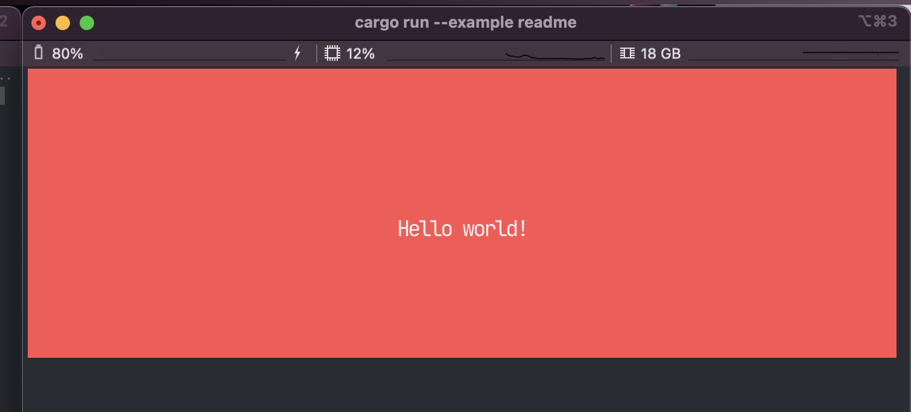

  <h1>Plasmo</h1>
  

    <strong>A beautiful terminal user interfaces library in Rust.</strong>
  

  <!-- Crates version -->
  
  <!-- Downloads -->
  
  <!-- docs -->
  
  <!-- CI -->
  
  <!-- Discord -->
  

 

Leverage CSS, HTML, and Rust to build beautiful, portable, terminal user interfaces. Plasmo is the cross-framework library that powers [`Dioxus-TUI`](https://github.com/DioxusLabs/dioxus/tree/master/packages/dioxus-tui)

## Background

You can use Html-like semantics with inline styles, tree hierarchy, components, and more in your [`text-based user interface (TUI)`](https://en.wikipedia.org/wiki/Text-based_user_interface) application.

Plasmo is essentially a port of [Ink](https://github.com/vadimdemedes/ink) but for [`Rust`](https://www.rust-lang.org/). Plasmo doesn't depend on Node.js or any other JavaScript runtime, so your binaries are portable and beautiful.

## Limitations

- **Subset of Html**
  Terminals can only render a subset of HTML. We support as much as we can.
- **Particular frontend design**
  Terminals and browsers are and look different. Therefore, the same design might not be the best to cover both renderers.

## Status

**WARNING: Plasmo is currently under construction!**

Rendering a Dom works fine, but the ecosystem of widgets is not ready yet. Additionally, some bugs in the flexbox implementation might be quirky at times.

## Features

Plasmo features:

- [x] Flexbox-based layout system
- [ ] CSS selectors
- [x] inline CSS support
- [x] Built-in focusing system

* [ ] Widgets
* [ ] Support for events, hooks, and callbacks1
* [ ] Html tags2

1 Basic keyboard, mouse, and focus events are implemented.
2 Currently, most HTML tags don't translate into any meaning inside of Plasmo. So an `input` _element_ won't mean anything nor does it have any additional functionality.
