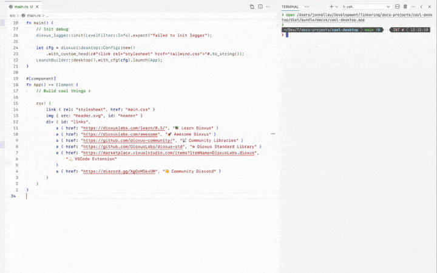

<p>
    <p align="center" >
      <!-- 
       -->
      <!-- <a href="https://dioxuslabs.com">
          
      </a> -->
      
      
      
      <br>
    </p>
</p>
<div align="center">
  <!-- Crates version -->
  <a href="https://crates.io/crates/dioxus">
    
  </a>
  <!-- Downloads -->
  <a href="https://crates.io/crates/dioxus">
    
  </a>
  <!-- docs -->
  <a href="https://docs.rs/dioxus">
    
  </a>
  <!-- CI -->
  <a href="https://github.com/jkelleyrtp/dioxus/actions">
    
  </a>

  <!--Awesome -->
  <a href="https://dioxuslabs.com/awesome">
    
  </a>
  <!-- Discord -->
  <a href="https://discord.gg/XgGxMSkvUM">
    
  </a>
</div>

<div align="center">
  <h3>
    <a href="https://dioxuslabs.com"> Website </a>
    <span> | </span>
    <a href="https://github.com/DioxusLabs/dioxus/tree/main/examples"> Examples </a>
    <span> | </span>
    <a href="https://dioxuslabs.com/learn/0.6/guide"> Guide </a>
    <span> | </span>
    <a href="https://github.com/DioxusLabs/dioxus/blob/main/translations/zh-cn/README.md"> 中文 </a>
    <span> | </span>
    <a href="https://github.com/DioxusLabs/dioxus/blob/main/translations/pt-br/README.md"> PT-BR </a>
    <span> | </span>
    <a href="https://github.com/DioxusLabs/dioxus/blob/main/translations/ja-jp/README.md"> 日本語 </a>
    <span> | </span>
    <a href="https://github.com/DioxusLabs/dioxus/blob/main/translations/tr-tr"> Türkçe </a>
    <span> | </span>
    <a href="https://github.com/DioxusLabs/dioxus/blob/main/translations/ko-kr"> 한국어 </a>
  </h3>
</div>
<br>
<p align="center">
  <a href="https://dioxuslabs.com/blog/release-060/">✨ Dioxus 0.6 is released - check it out here! ✨</a>
</p>
<br>

Web、デスクトップ、モバイルなど、単一のコードベースで構築します。ゼロコンフィグのセットアップ、統合されたホットリロード、シグナルベースの状態管理。サーバー機能を追加し、CLIでバンドルします。

```rust
fn app() -> Element {
    let mut count = use_signal(|| 0);

    rsx! {
        h1 { "High-Five counter: {count}" }
        button { onclick: move |_| count += 1, "Up high!" }
        button { onclick: move |_| count -= 1, "Down low!" }
    }
}
```

## ⭐️ ユニークな機能:

- 3行のコードでクロスプラットフォームアプリ（Web、デスクトップ、モバイル、サーバーなど）
- [人間工学に基づいた状態管理](https://dioxuslabs.com/blog/release-050)は、React、Solid、Svelteの長所を組み合わせています
- Rustの最速のwasmフレームワーク[sledgehammer](https://dioxuslabs.com/blog/templates-diffing)によって駆動される非常に高いパフォーマンス
- Web、macOS、Linux、Windowsにデプロイするための統合バンドラー
- そしてもっと！[Dioxusのツアーを見てみましょう](https://dioxuslabs.com/learn/0.6/)。

## インスタントホットリロード

1つのコマンド`dx serve`でアプリを実行します。マークアップとスタイルを編集し、結果をリアルタイムで確認します。

<div align="center">
  
</div>


## ファーストクラスのAndroidおよびiOSサポート

Dioxusは、Rustでネイティブモバイルアプリを構築する最速の方法です。単に`dx serve --platform android`を実行すると、数秒でエミュレーターまたはデバイスでアプリが実行されます。JNIおよびネイティブAPIに直接呼び出します。

<div align="center">
  
</div>

## Web、デスクトップ、モバイル用のバンドル

単に`dx bundle`を実行すると、アプリがビルドされ、最大化された最適化でバンドルされます。Webでは、[`.avif`生成、`.wasm`圧縮、最小化](https://dioxuslabs.com/learn/0.6/guides/assets)などを活用します。[50kb未満](https://github.com/ealmloff/tiny-dioxus/)のWebアプリや5mb未満のデスクトップ/モバイルアプリを構築します。

<div align="center">
  
</div>


## 素晴らしいドキュメント

私たちは、クリーンで読みやすく包括的なドキュメントを作成するために多大な努力を払いました。すべてのHTML要素とリスナーはMDNドキュメントで記録されており、私たちのドキュメントサイトはDioxus自体と継続的に統合されており、ドキュメントが常に最新であることを保証します。ガイド、リファレンス、レシピなどについては、[Dioxusウェブサイト](https://dioxuslabs.com/learn/0.6/)をご覧ください。面白い事実：私たちはDioxusウェブサイトを新しいDioxus機能のテストベッドとして使用しています - [チェックしてみてください！](https://github.com/dioxusLabs/docsite)

<div align="center">
  
</div>

## コミュニティ

Dioxusはコミュニティ主導のプロジェクトであり、非常に活発な[Discord](https://discord.gg/XgGxMSkvUM)および[GitHub](https://github.com/DioxusLabs/dioxus/issues)コミュニティを持っています。私たちは常に助けを求めており、質問に答え、あなたが始めるのを手伝うことを喜んでいます。[私たちのSDK](https://github.com/DioxusLabs/dioxus-std)はコミュニティによって運営されており、無料のアップグレードとサポートを受ける最高のDioxusクレートのための[GitHub組織](https://github.com/dioxus-community/)もあります。

<div align="center">
  
</div>

## フルタイムのコアチーム

Dioxusは、副業プロジェクトからフルタイムのエンジニアの小さなチームに成長しました。FutureWei、Satellite.im、GitHub Acceleratorプログラムの寛大なサポートのおかげで、私たちはDioxusにフルタイムで取り組むことができました。私たちの長期的な目標は、高品質の有料エンタープライズツールを提供することでDioxusを自立させることです。あなたの会社がDioxusの採用に興味があり、私たちと一緒に働きたい場合は、お問い合わせください！

## サポートされているプラットフォーム

<div align="center">
  <table style="width:100%">
    <tr>
      <td>
      <b>Web</b>
      </td>
      <td>
        <ul>
          <li>WebAssemblyを使用してDOMに直接レンダリング</li>
          <li>SSRで事前レンダリングし、クライアントで再ハイドレーション</li>
          <li>Reactと同等の約50kbのシンプルな「Hello World」</li>
          <li>迅速な反復のための組み込みの開発サーバーとホットリロード</li>
        </ul>
      </td>
    </tr>
    <tr>
      <td>
      <b>デスクトップ</b>
      </td>
      <td>
        <ul>
          <li>Webviewを使用してレンダリングするか、実験的にWGPUまたは<a href="https://freyaui.dev">Freya</a>（Skia）を使用してレンダリング</li>
          <li>ゼロコンフィグのセットアップ。単に`cargo run`または`dx serve`でアプリをビルド</li>
          <li>IPCなしでネイティブシステムアクセスを完全にサポート</li>
          <li>macOS、Linux、Windowsをサポート。ポータブル<3mbバイナリ</li>
        </ul>
      </td>
    </tr>
    <tr>
      <td>
      <b>モバイル</b>
      </td>
      <td>
        <ul>
          <li>Webviewを使用してレンダリングするか、実験的にWGPUまたはSkiaを使用してレンダリング</li>
          <li>iOSおよびAndroidのサポート</li>
          <li>「Hello World」から数秒でデバイス上で実行</li>
        </ul>
      </td>
    </tr>
    <tr>
      <td>
      <b>サーバーサイドレンダリング</b>
      </td>
      <td>
        <ul>
          <li>サスペンス、ハイドレーション、サーバーサイドレンダリング</li>
          <li>サーバー機能を使用してバックエンド機能を迅速に追加</li>
          <li>エクストラクタ、ミドルウェア、およびルーティングの統合</li>
          <li>静的サイト生成およびインクリメンタル再生成</li>
        </ul>
      </td>
    </tr>
  </table>
</div>

## 例を実行する

> このリポジトリのメインブランチにある例は、dioxusのgitバージョンとCLIを対象としています。最新の安定版dioxusと互換性のある例を探している場合は、[0.6ブランチ](https://github.com/DioxusLabs/dioxus/tree/v0.6/examples)を確認してください。

このリポジトリのトップレベルにある例は、次のように実行できます：

```sh
cargo run --example <example>
```

ただし、dioxus-cliをダウンロードすることをお勧めします。gitバージョンのdioxusを実行している場合は、次のコマンドで一致するバージョンのCLIをインストールできます：

```sh
cargo install --git https://github.com/DioxusLabs/dioxus dioxus-cli --locked
```

CLIを使用すると、Webプラットフォームで例を実行することもできます。このコマンドを使用してデフォルトのデスクトップ機能を無効にし、Web機能を有効にします：

```sh
dx serve --example <example> --platform web -- --no-default-features
```

## Dioxusと他のフレームワークの比較

私たちはすべてのフレームワークを愛しており、Rustエコシステムの革新を見守るのを楽しんでいます。実際、私たちの多くのプロジェクトは他のフレームワークと共有されています。たとえば、私たちのフレックスボックスライブラリ[Taffy](https://github.com/DioxusLabs/taffy)は、[Bevy](https://bevyengine.org/)、[Zed](https://zed.dev/)、[Lapce](https://lapce.dev/)、[Iced](https://github.com/iced-rs/iced)などで使用されています。

Dioxusは、他のフレームワークとは異なるいくつかの重要なポイントに重点を置いています：

- **Reactのように**：コンポーネント、props、フックなどの概念を使用してUIを構築し、状態管理はSolidJSよりもSvelteに近いです。
- **HTMLとCSS**：HTMLとCSSを完全に活用し、quirks（癖）もすべて受け入れます。
- **レンダラーに依存しない**：高速なVirtualDOMのおかげで、任意のプラットフォームのレンダラーに置き換えることができます。
- **協力的**：可能な限り、[Taffy](https://github.com/DioxusLabs/taffy)、[manganis](https://github.com/DioxusLabs/manganis)、[include_mdbook](https://github.com/DioxusLabs/include_mdbook)、[blitz](http://github.com/dioxusLabs/blitz)などのクレートを分割して、エコシステムが一緒に成長できるようにします。

### DioxusとTauriの比較

Tauriは、React、Vue、SvelteなどのWebベースのフレームワークを使用してフロントエンドが記述されたデスクトップ（およびモバイル）アプリを構築するためのフレームワークです。ネイティブの作業が必要な場合は、Rust関数を記述し、フロントエンドから呼び出すことができます。

- **ネイティブRust**：Tauriのアーキテクチャは、UIをJavaScriptまたはWebAssemblyに制限します。Dioxusを使用すると、Rustコードがユーザーのマシンでネイティブに実行され、スレッドの生成、ファイルシステムへのアクセスなどの操作をIPCブリッジなしで実行できます。これにより、アプリケーションのアーキテクチャが大幅に簡素化され、構築が容易になります。Dioxus-Webをフロントエンドとして使用してTauriアプリを構築することもできます。

- **異なる範囲**：TauriはJavaScriptとその複雑なビルドツールチェーンをサポートする必要があるため、使用できる範囲が制限されます。DioxusはRustに完全に焦点を当てているため、サーバー関数、高度なバンドル、ネイティブレンダラーなどの追加のユーティリティを提供できます。

- **共有DNA**：TauriとDioxusは別々のプロジェクトですが、Tauriチームが維持するウィンドウとWebviewライブラリであるTaoとWryなどのライブラリを共有しています。

### DioxusとLeptosの比較

Leptosは、SolidJSおよびSolidStartに似たフルスタックWebアプリケーションを構築するためのライブラリです。2つのライブラリはWeb上で同様の目標を共有していますが、いくつかの重要な違いがあります：

- **リアクティビティモデル**：Leptosは信号を基本的なリアクティビティとして使用し、DioxusはVirtualDomと再レンダリングを選択します。理論的には信号がより効率的ですが、実際には、[block-domに触発されたテンプレート](https://dioxuslabs.com/blog/templates-diffing)のおかげで、DioxusのVirtualDomは実際の違いをほとんど生じさせず、[実際にはLeptosよりも高速です](https://krausest.github.io/js-framework-benchmark/2024/table_chrome_123.0.6312.59.html)。

- **制御フロー**：Leptosは信号を使用してリアクティビティを実現するため、`for`ループや`if`文などのLeptosのプリミティブに制限されます。これを間違えると、アプリケーションはリアクティビティを失い、デバッグが難しいUIの問題が発生します。Dioxusを使用すると、イテレータ、通常のRustの`for`ループ、および`if`文を使用でき、アプリケーションは引き続きリアクティブです。実際には、リストにカウンターを挿入するDioxusコンポーネントは次のようになります：

```rust
fn Counters() -> Element {
    let mut counters = use_signal(|| vec![0; 10]);

    rsx! {
        button { onclick: move |_| counters.push(counters.len()), "Add Counter" }
        ul {
            for idx in 0..counters.len() {
                li {
                    button { onclick: move |_| counters.write()[idx] += 1, "{counters.index(idx)}" }
                    button { onclick: move |_| { counters.remove(idx); }, "Remove" }
                }
            }
        }
    }
}
```

[Leptosでは、`<For>`コンポーネントを使用します。](https://book.leptos.dev/view/04_iteration.html#dynamic-rendering-with-the-for-component):

```rust
fn Counters() -> impl IntoView {
    let counters = RwSignal::new(vec![0; 10]);

    view! {
        <button on:click=move |_| counters.update(|n| n.push(n.len()))>"Add Counter"</button>
        <For
            each=move || 0..counters.with(Vec::len)
            key=|idx| *idx
            let:idx
        >
            <li>
                <button on:click=move |_| counters.update(|n| n[idx] += 1)>
                    {Memo::new(move |_| counters.with(|n| n[idx]))}
                </button>
                <button on:click=move |_| counters.update(|n| { n.remove(idx); })>
                    "Remove"
                </button>
            </li>
        </For>
    }
}
```

- **`Copy`状態**：Dioxus 0.1から0.4までは、Rustの借用チェッカーのルールを緩和するためにライフタイムに依存していました。これはイベントハンドラにはうまく機能しましたが、非同期の面ではうまく機能しませんでした。Dioxus 0.5では、Leptosから借用した[`Copy`状態モデル](https://crates.io/crates/generational-box)に移行しました。

- **異なる範囲**：Dioxusは、Web、デスクトップ、モバイル、LiveViewなどのレンダラーを提供します。また、コミュニティライブラリとクロスプラットフォームSDKを維持しています。この作業の範囲は広く、歴史的にLeptosよりもリリースサイクルが遅くなっています。LeptosはフルスタックWebに焦点を当てており、Dioxusにはないislands、`<Form />`コンポーネント、およびその他のWeb専用のユーティリティなどの機能を提供します。一般的に、Leptosで構築されたWebアプリケーションは、より小さなフットプリントを持ちます。

- **異なるDSL**：2つのフレームワークはどちらもWebを対象としていますが、DioxusはUIを構築するために独自のカスタムRust風DSLを使用し、LeptosはよりHTML風の構文を使用します。これは、コード折りたたみや構文ハイライトなどのIDE機能との互換性を維持するために選択されました。一般的に、DioxusはそのDSLでより多くの「魔法」を活用します。たとえば、dioxusは文字列を自動的にフォーマットしますが、Leptosはクロージャと`format!`または`format_args!`マクロを使用する必要があります。

```rust
// dioxus
rsx! {
  div { class: "my-class", enabled: true, "Hello, {name}" }
}

// leptos
view! {
  <div class="my-class" enabled={true}>
    "Hello "
    {move || name()}
  </div>
}
```

### DioxusとYewの比較

Yewは、シングルページWebアプリケーションを構築するためのフレームワークであり、最初はDioxusのインスピレーションとなりました。残念ながら、Yewのアーキテクチャは私たちが望むさまざまな機能をサポートしていなかったため、Dioxusが誕生しました。

- **シングルページアプリケーション**：YewはシングルページWebアプリケーション専用に設計されており、Webプラットフォームに本質的に結びついています。Dioxusはフルスタックでクロスプラットフォームであり、Web、デスクトップ、モバイル、サーバーアプリケーションの構築に適しています。

- **開発者ツール**：Dioxusは、オートフォーマット、ホットリロード、バンドラーなどの多くのユーティリティを提供します。

- **継続的なサポート**：Dioxusは、新機能とバグ修正が毎日追加され、非常に積極的に維持されています。

### Dioxusとeguiの比較

eguiは、[Rerun.io](https://www.rerun.io)のようなツールを駆動するRust用のクロスプラットフォームGUIライブラリです。

- **Immediate vs Retained**：eguiは、各フレームで再レンダリングされるように設計されています。これはゲームやその他のインタラクティブなアプリケーションに適していますが、フレーム間でスタイルとレイアウトの状態を保持しません。Dioxusは、UIが一度構築され、その後フレーム間で変更される保持されたUIフレームワークです。これにより、DioxusはHTMLやCSSなどのネイティブWeb技術を使用でき、バッテリー寿命とパフォーマンスが向上します。

- **カスタマイズ可能**：eguiは独自のスタイリングとレイアウトソリューションを提供しますが、Dioxusは組み込みのHTMLとCSSの使用を期待しています。これにより、dioxusアプリケーションはTailwindやMaterial UIなどの任意のCSSライブラリを使用できます。

- **状態管理**：eguiの状態管理は、単一のグローバル状態オブジェクトに基づいています。Dioxusは、コンポーネントとプロパティを使用して状態のカプセル化を奨励し、コンポーネントの再利用性を高めます。

### DioxusとIcedの比較

Icedは、Elmに触発されたクロスプラットフォームGUIライブラリです。IcedはWGPUを使用してネイティブにレンダリングし、DOMノードを使用してWebをサポートします。

- **Elm状態管理**：Icedは、メッセージパッシングとリデューサーに基づくElmの状態管理モデルを使用します。これは単にDioxusとは異なる状態管理モデルであり、時にはかなり冗長になることがあります。

- **ネイティブな感触**：Dioxusは、レンダラーとしてwebviewを使用するため、ネイティブのテキスト入力、ペースト処理、およびアクセシビリティなどの他のネイティブ機能を自動的に取得します。Icedのレンダラーは現在これらの機能を実装していないため、あまりネイティブに感じられません。

- **WGPU**：DioxusのWGPUレンダラーは現在かなり未熟であり、まだプロダクションでの使用には準備ができていません。IcedのWGPUレンダラーははるかに成熟しており、プロダクションで使用されています。これにより、Icedで構築できるGPUアクセスが必要な特定のタイプのアプリケーションが可能になりますが、現在のところDioxusでは構築できません。

### DioxusとElectronの比較

DioxusとElectronは、目標が似ている完全に異なる2つのプロジェクトです。Electronは、開発者がHTML、CSS、JavaScriptなどのWeb技術を使用してクロスプラットフォームのデスクトップアプリケーションを構築できるようにします。

- **軽量**：Dioxusは、システムのネイティブWebView、またはオプションでWGPUレンダラーを使用してUIをレンダリングします。これにより、典型的なDioxusアプリケーションはmacOSで約15mbであり、Electronは100mbです。Electronは、ホストOSとシステムリソースをDioxusと同じように共有できない埋め込みのChromiumインスタンスも提供します。

- **成熟度**：Electronは、大規模なコミュニティと多くのツールを備えた成熟したプロジェクトです。Dioxusは、Electronに比べてまだ非常に若いです。deeplinkingなどの機能を実装するために追加の作業が必要な場合があります。

## コントリビュート

- [コントリビュートに関するセクション](https://dioxuslabs.com/learn/0.6/contributing)を参照してください。
- [issue tracker](https://github.com/dioxuslabs/dioxus/issues)で問題を報告してください。
- Discordに[参加](https://discord.gg/XgGxMSkvUM)して質問してください！

<a href="https://github.com/dioxuslabs/dioxus/graphs/contributors">
  
</a>

## ライセンス

このプロジェクトは[MITライセンス]の下でライセンスされています。

[MITライセンス]: https://github.com/DioxusLabs/dioxus/blob/master/LICENSE-MIT

あなたが明示的に別段の定めをしない限り、あなたによってDioxusに含めるために意図的に提出されたすべてのコントリビュートは、追加の条件なしにMITライセンスの下でライセンスされるものとします。
