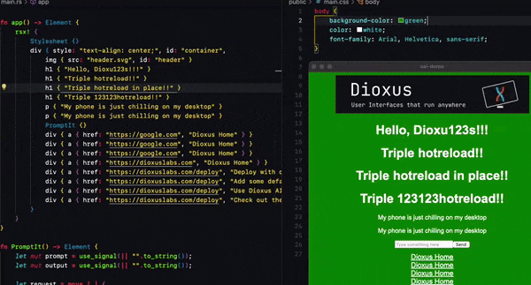

<p>
    <p align="center" >
      
      
      <a href="https://dioxuslabs.com">
          
      </a>
    </p>
</p>
<div align="center">
  <!-- Crates version -->
  <a href="https://crates.io/crates/dioxus">
    
  </a>
  <!-- Downloads -->
  <a href="https://crates.io/crates/dioxus">
    
  </a>
  <!-- docs -->
  <a href="https://docs.rs/dioxus">
    
  </a>
  <!-- CI -->
  <a href="https://github.com/jkelleyrtp/dioxus/actions">
    
  </a>

  <!--Awesome -->
  <a href="https://dioxuslabs.com/awesome">
    
  </a>
  <!-- Discord -->
  <a href="https://discord.gg/XgGxMSkvUM">
    
  </a>
</div>

<div align="center">
  <h3>
    <a href="https://dioxuslabs.com"> Website </a>
    <span> | </span>
    <a href="https://github.com/DioxusLabs/example-projects"> Examples </a>
    <span> | </span>
    <a href="https://dioxuslabs.com/learn/0.5/guide"> Guide </a>
    <span> | </span>
    <a href="https://github.com/DioxusLabs/dioxus/blob/main/translations/zh-cn/README.md"> 中文 </a>
    <span> | </span>
    <a href="https://github.com/DioxusLabs/dioxus/blob/main/translations/pt-br/README.md"> PT-BR </a>
    <span> | </span>
    <a href="https://github.com/DioxusLabs/dioxus/blob/main/translations/ja-jp/README.md"> 日本語 </a>
    <span> | </span>
    <a href="https://github.com/DioxusLabs/dioxus/blob/main/translations/tr-tr"> Türkçe </a>
  </h3>
</div>
<br>
<br>

> Çevirmen Notu (Translator Note): Teknik terimleri orijinal haliyle kullanıp, olabildiğince açıklamaya çalıştım ki hem tecrübeli hem de yeni başlayan arkadaşlar için daha kolay olsun diye. Sektör dilimiz İngilizce olduğundan parantez içindeki bilgiler çoğunlukla yeni dostlar için, tecrübeli arkadaşlar zaten terimlere de ne anlama geldiklerine de aşina. Teknik terimleri günlük hayatta da orijinal halinde kullandığımızdan, kavramları Türkçe'ye çevirme kısmı garip oldu. Gerekli de değildi ama yine de bilmeyen insanların da kafalarında bir şeyler canlandırmaya çalıştım. Yoksa kimse frontend için önyüz demiyor yahut framework yerine Türkçe bir şeyler kullanmıyoruz, ben de farkındayım. Çok da rahatsız etmemek adına sadece kavramlarla ilk karşılaştığınız yerlerde açıkladım devamında orijinal haliyle kullandım. Hatalar varsa affola.

Web, masaüstü ve mobil; tek bir kod altyapısıyla üret. Eforsuz kurulum, entegre hotreloading(sürekli kendin derlemek yerine, güncelleme tespit edildikçe otomatik aktifleşmesi) ve sinyal temelli durum yönetimi. Sunucu fonksiyonları ile backend (arkayüz) özellikleri ekle ve CLI (Command-line Interface(Komut-satırı Arayüzü, terminal uygulaması))ile paketle (`dx bundle` sayesinde).

```rust
fn app() -> Element {
    let mut count = use_signal(|| 0);

    rsx! {
        h1 { "High-Five counter: {count}" }
        button { onclick: move |_| count += 1, "Up high!" }
        button { onclick: move |_| count -= 1, "Down low!" }
    }
}
```

## ⭐️ Nevi Şahsına Münhasır Özellikler:

- 3 satır kod ile çapraz platform uygulamalar (web, masaüstü, mobil, sunucu ve daha fazlası).
- [Ergonomik durum yönetimi](https://dioxuslabs.com/blog/release-050) React, Solid ve Svelte'nin en iyi özelliklerini birleştirdik.
- Rust'ın en en hızlı wasm(WebAssembly)-framework'ü (yazılım geliştirmek için kullanılan kütüphanelerin bir araya gelmesi ile oluşan yapılar) ile yüksek performans [sledgehammer](https://dioxuslabs.com/blog/templates-diffing).
- Web, macOS, Linux ve Windows üzerinde deploy (yayınlamak) için entegre paketleyici (burada belirtilen `dx bundle` bizim için işleri hallediyor).
- Ve daha fazlası! Gözat -> [Dioxus turu](https://dioxuslabs.com/learn/0.5/).

## Anında hot-reloading

Tek bir `dx serve` komutu ile uygulamanı çalıştır. Markup ve styles(html ve css aklınıza gelebilir burada, Dioxus da rsx ile yapıyorsunuz bu tarz şeyleri. Ekstradan css düzenlemeleri de yapabilirsiniz) düzenle ve sonucunu gerçek zamanlı gör. Rust'ın hotreloading özellikleri halen birinci sınıf olmasa da [hot-lib-reloader](https://docs.rs/hot-lib-reloader/latest/hot_lib_reloader/) ile mümkün.

<div align="center">
  
</div>

## Web ve Masaüstü için Paketleyici

Basitçe `dx bundle` komutunu çalıştır ve uygulaman maksimum optimizasyon ile derlenip paketlensin. Web üzerindeki [`.avif` oluşturma, `.wasm` sıkıştırma, küçültme](https://dioxuslabs.com/learn/0.5/reference/assets) ve daha fazlası ile avantajı yakala. [50kb'dan daha küçük](https://github.com/ealmloff/tiny-dioxus/) hafif web uygulamaları ve 15mb'dan daha az boyutlarda masaüstü/mobil uygulamalar üret.

<div align="center">
  
</div>

## Fantastik Dökümantasyon

Temiz, okunabilir ve kapsayıcı döküman için bir ton uğraştık. Bütün html elementleri ve listeners(takipçiler) MDN (geliştiriciler için dökümantasyon detay için [tıkla](https://developer.mozilla.org)) ile dökümente edildi, ve güncelliğinden emin olmak için docsite(dökümanlar) Dioxus'un kendisi ile sürekli entegrasyon halinde. Rehbeler, referanslar, tarifler, ve daha fazlası için göz at [Dioxus websitesi](https://dioxuslabs.com/learn/0.5/). İlginç gerçek: Dioxus'un sitesini yeni özelliklerimizi test etmek için deneme tahtası olarak kullanıyoruz -> [Göz at!](https://github.com/dioxusLabs/docsite)

<div align="center">
  
</div>

## Geliştirici Deneyimini Önemse

Dioxus geliştirici deneyimini önceliklendirir, bu kapsamda end-to-end tooling (uçtan uca araç desteği) için tonla efor harcadık. [VSCode eklentisi](https://marketplace.visualstudio.com/items?itemName=DioxusLabs.dioxus) geliştirdik bu sayede RSX kodlarınızı otomatik formatlayabilir, HTML', RSX e çevirebilir ve daha fazlasını yapabilirsiniz. Aynı zamanda geliştirdiğimiz çok güçlü [CLI](https://dioxuslabs.com/learn/0.5/CLI) sayesinde yeni uygulamalar üretmenize yardım ediyor, onları serve (sunmanızı) ve çapraz platform çalışacak şekilde paketlemenizi sağlıyoruz. Yol haritamızda deployment da mevcut.

<div align="center">
  
</div>

## Topluluk

Dioxus topluluk tarafından yürütülen epey aktif [Discord](https://discord.gg/XgGxMSkvUM) ve [GitHub](https://github.com/DioxusLabs/dioxus/issues) topluluğuna sahip bir proje. Her zaman yardım alıyoruz, sorularınızı cevaplamaktan mutlu oluyoruz ve projelerinize başlamanız için size destek oluyoruz. [SDK'mız (Software Development Kit (Yazılım Geliştirme Paketi))](https://github.com/DioxusLabs/dioxus-std) topluluk tarafından geliştiriliyor ve hatta [GitHub organizasyonu](https://github.com/dioxus-community/) ile ücretsiz güncelleme ve destek alan, en iyi Dioxus uygulamalarına ulaşabilirsiniz.

<div align="center">
  
</div>

## Tam Zamanlı Çalışan Çekirdek Kadro

Ek proje olarak başlayan Dioxus küçük bir takımın tam zamanlı çalıştığı bir hale geldi. FutureWei, Satellite.im ve Github Accelerator programları sayesinde Dioxus üzerinde tam zamanlı olarak çalışabiliyoruz. Uzun vade planımız ise yüksek kaliteli ücretli kurumsal araçlar sunarak, Dioxus'u kendine yetebilen bir hale getirmek. Eğer şirketiniz Dioxus kullanmak ve bizimle çalışmak isterse, lütfen bize ulaşın!

## Desteklenen Platformlar

<div align="center">
  <table style="width:100%">
    <tr>
      <td>
      <b>Web</b>
      <br />
      <em>1. Seviye Destek</em>
      </td>
      <td>
        <ul>
          <li>WebAssembly kullanarak doğrudan DOM'a (Document Object Model (Döküman Objesi Modeli, sayfaları manipüle etmenizi sağlayan yapı)) render(işle).</li>
          <li>SSR(Serve Side Rendering (Sunucu Tarafında İşleme)) ile ön işleme yap ve kullanıcı tarafında rehydrate(yeniden destekle).</li>
          <li>React ile kıyaslanır seviyede basit bir "Merhaba Dünya" kodu 50kb civarında.</li>
          <li>Entegre geliştirme sunucusu (`dx serve`) ve hot reloading ile hızlı iterasyonlar gerçekleştir.</li>
        </ul>
      </td>
    </tr>
    <tr>
      <td>
      <b>Fullstack(önyüz ve arkayüzün birlikte var olduğu)</b>
      <br />
      <em>1. Seviye Destek</em>
      </td>
      <td>
        <ul>
          <li>Suspense(yapılması uzun sürecek işlemler için fallback(geçici gösterge diyebiliriz sanırım, yükleme ekranı örneği verilebilir) imkanı), hydration(besleme, destekleme), and server-side rendering(sunucuda işleme)</li>
          <li>Sunucu fonksiyonları sayesinde dahili backend</li>
          <li>Extractors(Ayırıcılar), middleware(ara katman), and routing(yönlendirici) entegrasyonları</li>
          <li>Mobil ve masaüstü ile uyumlu!</li>
        </ul>
      </td>
    </tr>
    <tr>
      <td>
      <b>Masaüstü</b>
      <br />
      <em>1. Seviye Destek</em>
      </td>
      <td>
        <ul>
          <li>Webview(arayüzü websiteye benzer şekilde gösteren yapı) ya da - deneysel olarak - WGPU(Web GPU(web temelli grafik arabirimi ile grafik kartını kullanarak işleme kabiliyeti sağlayan yapı)) veya <a href="https://freyaui.dev">Freya</a> (skia) ile işleme yap </li>
          <li>Kolay kurulum. Basitçe `cargo run` ya da `dx serve` ile uygulamanı derle. </li>
          <li>IPC(Inter Process Communication(İşlemleri birbiriyle konuşturan sistem)) kullanmadan doğdurdan sistem erişimi. </li>
          <li>macOS, Linux ve Windows desteklenir. Taşınabilir <3mb binaries(çalıştırılan dosya (exe örneğini vermiş olalım)) </li>
        </ul>
      </td>
    </tr>
    <tr>
      <td>
      <b>Liveview(uygulamanın sunucuda çalışıp kullanıcı tarafında işlendiği yapı)</b>
      <br />
      <em>1. Seviye Destek</em>
      </td>
      <td>
        <ul>
          <li>Uygulamayı - ya da sadece bir componenti(komponent) - tamamıyla sunucuda işle.</li>
          <li>Axum ve Warp gibi popüler Rust frameworkleri ile entegrasyon.</li>
          <li>10.000+ uygulamayı destekleyebilme ve aşırı düşük gecikme.</li>
        </ul>
      </td>
    </tr>
    <tr>
      <td>
      <b>Mobil</b>
      <br />
      <em>2. Seviye Destek</em>
      </td>
      <td>
        <ul>
          <li>Webview ya da - deneysel olarak - WGPU yahut Skia ile işleme.</li>
          <li>iOS ve Android desteği. </li>
          <li>Şuanda oldukça deneysel, birsürü geliştirme 2024 boyunca gelmeye devam edecek. </li>
        </ul>
      </td>
    </tr>
    <tr>
      <td>
      <b>Terminal</b>
      <br />
      <em>2. Seviye Destek</em>
      </td>
      <td>
        <ul>
          <li><a href="https://github.com/vadimdemedes/ink"> ink.js</a> ile benzer şekilde uygulamaları doğrudan terminalde render et.</li>
          <li>Tarayıcıdaki flexbox ve CSS modeline benzer yapılardan güç alır.</li>
          <li>Metin girdisi, butonlar ve odak sistemi gibi dahili widgets(araçlar).</li>
        </ul>
      </td>
    </tr>
  </table>
</div>

## Örnekleri Çalıştırma

En üst klasördeki örnekleri çalıştırmak için `cargo run --example <örnek adı>` yeterli olacaktır. Ancak, size tavsiyemiz dioxus-cli indirerek örnekleri `dx serve` ile çalıştırmanızdır, çünkü birçok örnek aynı zamanda web platformunu da destekliyor. Web için çalıştırmak isterseniz Cargo.toml üzerinde düzenleme yapmanız ya da varsayılan masaüstü özelliğini devredışı bırakmanız gerekir.

## Dioxus ve Diğer Frameworkleri Kıyaslayalım

Bizler bütün frameworkleri seviyor ve Rust ekosisteminde gelişimlerini izlemekten keyif alıyoruz. Bu bağlamda bizim projelerimizin de birçoğu diğer frameworkler tarafından kullanılıyor. Örnek vermek gerekirse, flex-box kütüphanemiz [Taffy](https://github.com/DioxusLabs/taffy); [Bevy](https://bevyengine.org/), [Zed](https://zed.dev/), [Lapce](https://lapce.dev/), [Iced](https://github.com/iced-rs/iced), ve çok daha fazla yerde kullanılmakta.

Dioxus'u diğer frameworklerden ayıran birkaç vurguladığı nokta var:

- **React-benzeri**: Components, props(fonksiyon argümanlarına benzer olan yapılar) ve hooks(fonksiyon componentlerinin diğer framework özelliklerine erişmesini sağlayan yapılar) gibi konseptler üzerine bina ettik. Bu durum bizi SolidJS'ten ziyade Svelte'ye yaklaştırdı.
- **HTML ve CSS**: Quirks(geriye uyumluluk) ve diğer özellikler için, HTML ve CSS'i temel alıyoruz.
- **Renderer-agnostic(İşleyen Bağımsız)**: [Ürettiğimiz Hızlı VirtualDOM](https://dioxuslabs.com/blog/templates-diffing) sayesinde istediğiniz platform için renderer değiştebilirsiniz.
- **Collaborative(Birlikte çalışmayı destekleyen)**: Mümkün olduğu sürece bu örneklerdeki gibi crates(basitçe Rust üzerindeki kütüphaneler gibi düşünün) üretiyoruz: [Taffy](https://github.com/DioxusLabs/taffy), [manganis](https://github.com/DioxusLabs/manganis), [include_mdbook](https://github.com/DioxusLabs/include_mdbook), ve [blitz](http://github.com/dioxusLabs/blitz). Böylece ekosistemi birlikte büyütebiliriz.

### Dioxus ile Tauri'yi Kıyaslayalım

Tauri masaüstü -ve yakında mobil de dahil edilecek- üzerine frontend(önyüz) için React, Vue, Svelte vb. web temelli frameworklerini kullanan bir frameworktür. Ne zaman native (doğrudan çalışan, burada kastedilen işletim sistemine doğrudan bir işlem gerçekleştirmek istediğinizde) bir iş yapmak isterseniz Rust fonksiyonları yazarsınız ve bunları frontend üzerinden çağırmanız gerekir.

- **Natively Rust(Doğrudan Rust ile geliştirildi)**: Tauri'nin mimarisi sizi JavaScript ya da WebAssembly ile sınırlar. Dioxus ile Rust kodunuz kullanıcının makinesinde doğrudan çalışır. Thread spawn(iş parçacığı üretme), dosya sistemine erişme işlemlerini IPC köprü kullanmadan yapabilirsiniz.

- **Farklı Amaçlar**: Tauri JavaScript'i ve onun karmaşık build tooling(derleme araçlarını) desteklemek zorunda. Bu durum yapabileceğiniz işlemlerin kısıtlanmasına sebebiyet vermekte. Dioxus özel olarak Rust'a odaklandığından, server functions, gelişmiş bundling ve native renderer gibi ekstra özellikleri sunabiliyoruz.

- **Ortak DNA**: Tauri ve Dioxus farklı projeler olsa da windowing(pencere işlemleri) ve webview için Tao ve Wry gibi ortak olarak paylaştığı kütüphaneler mevcut.

### Dioxus ve Leptos'u Kıyaslayalım

Leptos SolidJS ve SoldStart benzeri fullstack web uygulamları geliştirebildiğiniz bir kütüphane. Dioxus ve Leptos web üzerinde benzer amaçlarla var olan 2 kütüphane ancak birkaç önemli nüans mevcut.

- **Reactivity model(Yeniden-aktifleştirme modeli)**: Leptops reactivity için signals (sinyaller) kullanırken, Dioxus Virtual(Sanal) DOM ve re-render(yeniden işleme) kullanır. Teoride signals çok daha verimli olurken pratikte [block-dom'dan ilham alınan taslaklar](https://dioxuslabs.com/blog/templates-diffing) sayesinde Virtual DOM neredeyse hiç fark oluşturmuyor. Kıyaslamada da görebileceğiniz gibi [aslında Leptos'tan hızlıyız](https://krausest.github.io/js-framework-benchmark/2024/table_chrome_123.0.6312.59.html).

- **Control flow(Karar verme mekanizmaları)**: Leptops reactivity için signals kullandığından, Leptos'un primitives (ilkelleri(her kodlama dilinde var olan, en temel şeyler için kullanılır genelde, farklı kullanımları da var tabiki. Örnek olarak veri tiplerine integer(tamsayı), bool(sadece 1 ve 0 değerini alan veri tipi) verebiliriz. Kontrol mekanizmaları için de for, if yapıları verilebilir.)) içerisinde sıkışırsınız. Örnek vermek gerekirse `for` döngüleri ve `if` ifadeleri. Eğer bu yapılarda bir hata meydana gelirse uygulamanız bütün reactivity(tepkiselliğini) özelliklerini kaybeder, bu durum UI(User Interface (Kullanıcı Arayüzü)) hatalarını debug(hata ayıklama) yapmanızı zorlaştırır. Dioxus ile birlikte iteratörler, sıradan Rust `for` döngüleri ve `if` durumlarını kullanabilir ve uygulamanız reactive kalmaya devam edebilir. Pratikte bir listeye counters(sayaçlar) eklemek istediğimiz bir örnek şu şekilde görünebilir:

```rust
fn Counters() -> Element {
  let mut counters = use_signal(|| vec![0; initial_length]);

  rsx! {
    button { onclick: move |_| counters.push(counters.len()); "Add Counter" }
    ul {
      for idx in 0..counters.len() {
        li {
          button { onclick: move |_| counters[idx] += 1; "{counters[idx]}" }
          button { onclick: move |_| { counters.write().remove(idx); } "Remove" }
        }
      }
    }
  }
}
```

[Ancak Leptos için bu durum önce key tracking (anahtarları izlemenizi) yapmanızı, `<For>` component kullanmanızı, yeni singnals oluşturmanızı ve sonunda da hafızayı manuel bir şekilde temizlemenizi gerektirir.](https://book.leptos.dev/view/04_iteration.html#dynamic-rendering-with-the-for-component):

```rust
fn Counters() -> Element {
    let initial_counters = (0..initial_length)
        .map(|id| (id, create_signal(id + 1)))
        .collect::<Vec<_>>();

    let (counters, set_counters) = create_signal(initial_counters);

    let add_counter = move |_| {
        let sig = create_signal(next_counter_id + 1);
        set_counters.update(move |counters| counters.push((next_counter_id, sig)));
        next_counter_id += 1;
    };

    view! {
        <div>
            <button on:click=add_counter>
                "Add Counter"
            </button>
            <ul>
                <For
                    each=counters
                    key=|counter| counter.0
                    children=move |(id, (count, set_count))| {
                        view! {
                            <li>
                                <button
                                    on:click=move |_| set_count.update(|n| *n += 1)
                                >
                                    {count}
                                </button>
                                <button
                                    on:click=move |_| {
                                        set_counters.update(|counters| {
                                            counters.retain(|(counter_id, (signal, _))| {

                                                if counter_id == &id {
                                                    signal.dispose();
                                                }
                                                counter_id != &id
                                            })
                                        });
                                    }
                                >
                                    "Remove"
                                </button>
                            </li>
                        }
                    }
                />
            </ul>
        </div>
    }
}
```

- **`Copy` state(Kopya oluşturma yöntemi)**: Dioxus 0.1 - 0.4 sürümleri boyunca Rust'ın borrow checker(ödünç almayı kontrol eden yapı (kısaca: Değişkenlerin geçerli olup olmadığını Rust standartlarında garanti eden yapı)) mekanizmasını esnetmek için lifetime(Rust lifetime yapıları(kısaca: Değişkenlerin ihtiyaç duyduğumuz zaman var olmasını kontrol eden bir sistem)) kullanılıyordu. Bu durum event handlers (olay yönetim yapıları) için iyi çalıştı ancak async (asenkron) tarafında işleri zora soktu. Dioxus 0.5 ile birlikte Leptos'tan ödünç aldığımız [`Copy`(Kopya oluşturma) modeline](https://crates.io/crates/generational-box) geçtik.

- **Farklı Amaçlar**: Dioxus web, masaüstü, mobil, LiveView ve çok daha fazla platform için renderer sunar. Aynı zamanda topluluk kütüphanelerini ve bir çapraz platform SDK'yi de geliştiriyoruz. Bu işlerin kapsadığı alan çok fazla ve bu durum Leptos'tan daha yavaş yeni sürüm yayınlamamıza sebebiyet veriyor. Leptos fullstack ve web'e odaklanırken aynı zamanda Dioxus'ta bulunmayan `<Suspense />` temelli HTML streaming(akış), islands(adalar(componentleri gruplandırıp wasm ile birlikte kullanıcının tarayıcısına gönderen yapı)), `<Form />`(HTML'ye benzer şekilde kullanıcı tarafında rooting(yönlendirme) yapmanızı sağlayan yapı) komponenetleri, ve başka webe özel özellikler. Genel olarak Leptos ile üreteceğiniz web uygulamaları daha küçük footprint'e(ayak izi) sahip olacaktır.

- **Farklı DSLs(Domain Specific Language(Bölgeye Özel Dil(Belirli alan içerisinde geçerli olan dil, meta language(dil) şeklinde de denk gelebilirsiniz))**: İki framework de web için kullanılabilir durumdadır. Dioxus UI geliştirmek için Rust benzeri DSL kullanırken Leptos daha çok HTML benzeri yapılar kullanır. Bu yöntemi seçmemizin sebebi ise codefolding(görsel olarak kodun bazı parçalarını kapatıp açmayı sağlayan özellik) ve syntax highlighting(yazım vurgulama(kod içerisinde fonksiyonları falan normal yazıdan daha ayırıcı -renkli, altı çizi- gösteren özellik)) gibi IDE(Integrated Development Environment (Entegre Geliştirme Ortamı)) tarafından sağlanan özelliklerinden yararlanabilmek. Genel olarak Dioxus DSL ile daha fazla özellik sağlamayı hedefler. Örnek vermek gerekirse Dioxus otomatik olarak stringleri(metinleri) birleştirirken Leptos closures(anonim fonksiyonlar) ile format!(Rust'ın string format makrosu(birleştirici yapı)) ya da format_args!(Rust'ın format! makrosunun temel aldığı daha genel makro) kullanmanızı bekler.

```rust
// dioxus
rsx! {
  div { class: "my-class", enabled: true, "Hello, {name}" }
}

// leptos
view! {
  <div class="my-class" enabled={true}>
    "Hello "
    {move || name()}
  </div>
}
```

### Dioxus ve Yew'i Kıyaslayalım

Tek sayfalı web uygulamaları geliştirmeyi sağlayan Yew, Dioxus için de ilham olmuştur. Ancak Yew'in mimarisi istediğimiz bazı özellikleri karşılamadığı için Dioxus'un doğumuna sebep oldu.

- **Tek Sayfa Web Uygulamaları**: Yew özel olarak tek sayfa web uygulamaları geliştirmek için tasarlandı ve doğal olarak bu onu web ile sınırlı kıldı. Dioxus ise çapraz platform fullstack uygulamalar geliştirilebilmesi sebebiyle web, masaüstü, mobil ve sunucu uygulamaları için uygun bir seçimdir.

- **Geliştirici Araçları**: Dioxus otomatik formatlama, hotreloading ve bundler gibi birçok araç sunar.

- **Devamlı Destek**: Dioxus yeni özelliklerle ve günlük olarak yapılan bug(hata) düzeltmeleri ile epey aktif bir şekilde geliştirilmekte.

### Dioxus ve egui'yi Kıyaslayalım

egui Rust için çapraz platform GUI(Grafical User Interface(Grafik Kullanıcı Arayüzü)) kütüphanesidir. [Rerun.io](https://www.rerun.io) gibi projelere de güç verir.

- **Immediate vs Retained(Kısaca: Her frame(kare) için sürekli yeni frame üreten mimari ile Değişiklik yapılmadıkça güncellenmeyen mimari)**: egui her frame için re-render yapılmak üzere tasarlanmıştır. Bu durum oyunlar ve başka interaktif uygulamalar için uygun olsa da style(stil) ve layout(ana yapı) frameler arasında korunmaz. Dioxus ise retained yapıda bir UI frameworktür, bu ise UI'ın bir kez üretilip frameler arasında güncelleneceği anlamına gelir. Bu durum Dioxus'un HTML, CSS gibi native web teknolojilerini kullanabilmesini, daha iyi pil ömrü ve performans göstermesini sağlar.

- **Özelleştirilebilirlik**: egui kendi styling ve layout çözümüyle gelirken Dioxus dahili olarak HTML ve CSS kullanmanızı bekler. Bu ise Dioxus uygulamalarının Tailwind ve Material UI gibi herhangi bir CSS kütüphanesini kullanabilmesine olanak sağlar.

- **State(Durum) Yönetimi**: egui'nin state yönetimi tek bir global state objesi üzerinden gerçekleşir. Dioxus ise bu bağlamda components ve props ile birlikte statelerin encapsulation(kapsülleme) işlemiyle tekrar tekrar kullanılabilmesini destekler.

### Dioxus ve Iced'ı Kıyaslayalım

Iced Elm'den esinlenmiş çapraz platform GUI kütüphanesidir. Iced WGPU ile native render sunar ve DOM nodes(düğümleri) ile webi de destekler.

- **Elm state Yönetimi**: Iced Elm state yönetim modelini sunar, bu ise reducers(fonksiyon gibi düşünebiliriz) ve mesaj iletim yoluyla gerçekleşir. Basitçe bu mimari Dioxus'tan farklıdır ve zaman zaman oldukça verbose (ayrıntılı, yorucu) olabilir.

- **Native Görünüm**: Dioxus'un renderer olarak webview kullanması sebebiyle otomatik olarak native metin kutularını, kopyala yapıştır fonksiyonlarını ve accessibility(erişilebilirlik) gibi diğer native özellikler sunar. Iced rendererı şuan için bu özellikleri içermemesi sebebiyle daha az native hissettirir.

- **WGPU**: Dioxus'un WGPU renderer özelliği şuan için çok olgunlaşmış değil ve ürün geliştirmeye uygun değil. Iced'ın WGPU rendererı ise çok daha olgun durumda ve ürün geliştirmek için kullanılabilir. Bu durumda bazı GPU(Graphical Processing Unit(Grafik İşleme Birimi, ekran kartınız aklınıza gelsin)) erişimi gerektiren uygulamalar için Iced kullanılabilirken Dioxus kullanılamaz.

### Dioxus ve Electron'u Kıyaslayalım

Dioxus ve Electron benzer amaçlara sahip tamamıyla farklı iki projedir. Electron geliştiricilerin HTML, CSS ve JavaScript gibi web teknolojilerini kullanarak çapraz platform masaüstü uygulamaları geliştirmelerini sağlar.

- **Hafif**: Dioxus sistemin native webview ya da opsiyonel olarak WGPU rendererını kullanarak UI render eder. Kıyaslamamız gerekirse bu durum tipik bir macOS uygulamasında Electron'un 100mb yer kapladığı yerde Dioxus uygulamasının 15mb ile var olmasını sağlar. Electron dahili olarak sistem kaynaklarını Dioxus'un paylaştığı gibi paylaşmayan gömülü bir chromium ile birlikte gelir.

- **Olgunluk**: Electron büyük bir topluluk ve birçok araç ile beraber olgun bir proje. Dioxus Electron ile kıyaslandığında halen oldukça genç. Deep link(Bazı protokoller için varsayılan olarak çalışma) gibi fazladan iş gerektiren özellikler için çalışmamız gerekiyor.

## Katkı Sağlama

- [Katkı sağlamayla alakalı kısım](https://dioxuslabs.com/learn/0.5/contributing) için web sitemizi ziyaret edin.
- [Issue tracker(sorun takipçisi)](https://github.com/dioxuslabs/dioxus/issues) üzerinden sorunlarınızı raporlayabilirsiniz.
- Discord'a [katıl](https://discord.gg/XgGxMSkvUM) ve sorularını sor!

<a href="https://github.com/dioxuslabs/dioxus/graphs/contributors">
  
</a>

## Lisans

Bu proje [MIT lisansı] altındadır.

[mit lisansı]: https://github.com/DioxusLabs/dioxus/blob/master/LICENSE-MIT

Özel olarak belirmediğiniz sürece Dioxus'a tarafınızca sağladığınız her katkı ekstra koşul ve madde olmaksızın MIT lisansı ile lisanslanacaktır.
